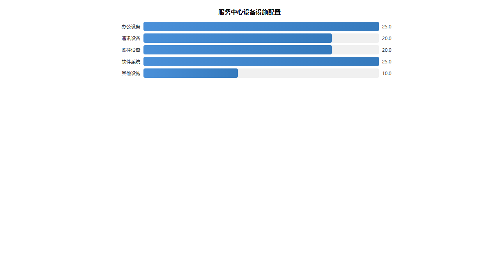
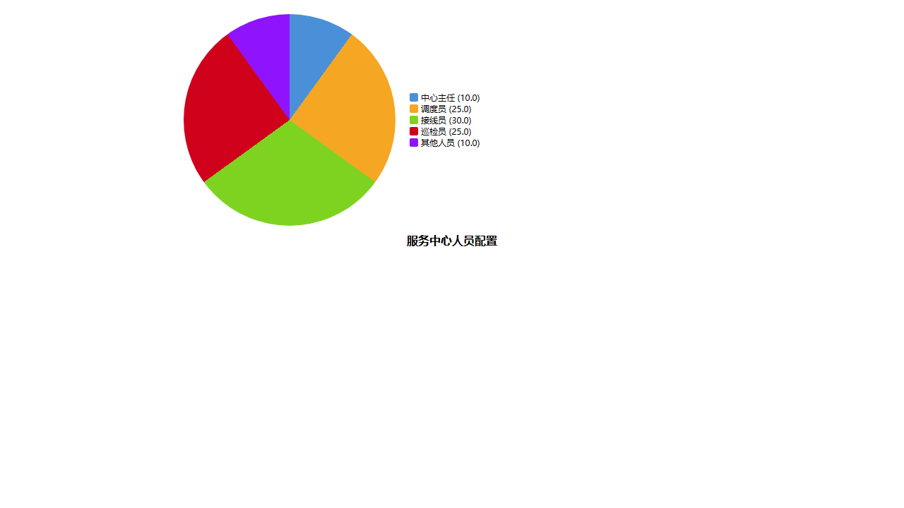

# 一站式服务中心方案

## 服务中心建设方案

### 方案目标

为满足广汉市人民医院后勤综合服务需求，我公司拟在医院院区内建设一站式服务中心，作为后勤服务的统一调度指挥平台。服务中心将整合清洁消毒、中央运输、维修维护、院感控制等各项后勤服务功能，实现"一站式受理、一体化调度、全过程监控"的服务模式，为医院提供高效、便捷、专业的后勤保障服务。

### 场地规划

服务中心选址于医院行政楼一层，建筑面积约120平方米，划分为以下功能区域：

| 功能区域 | 面积 | 功能说明 |
|---------|------|---------|
| 调度指挥区 | 40㎡ | 设置调度台、大屏幕，负责服务请求接收与任务分派 |
| 接线服务区 | 30㎡ | 设置接线坐席，负责电话接听与工单录入 |
| 监控值班区 | 20㎡ | 设置监控设备，24小时监控服务执行情况 |
| 会议培训区 | 20㎡ | 用于日常会议、员工培训及案例分析 |
| 物资存放区 | 10㎡ | 存放常用办公物资及应急物资 |

### 设备设施配置

服务中心配置完善的办公及通讯设备，确保服务高效运转：

**主要设备清单：**

| 设备类别 | 设备名称 | 数量 | 用途 |
|---------|---------|------|------|
| 办公设备 | 电脑工作站 | 8台 | 工单处理、数据管理 |
| 办公设备 | 打印机 | 2台 | 工单打印、报表输出 |
| 通讯设备 | IP电话系统 | 10部 | 服务热线接听 |
| 通讯设备 | 对讲机 | 20部 | 现场调度通讯 |
| 监控设备 | 监控大屏 | 2块 | 服务状态实时显示 |
| 监控设备 | 监控摄像头 | 16个 | 关键区域视频监控 |
| 其他设施 | UPS电源 | 2台 | 不间断供电保障 |
| 其他设施 | 空调系统 | 1套 | 环境温湿度控制 |

### 软件系统投入

服务中心采用智能化管理软件系统，实现服务全流程数字化管理：

| 系统名称 | 功能模块 | 投入预算 |
|---------|---------|---------|
| 后勤服务管理系统 | 工单管理、任务调度、绩效考核 | 15万元 |
| 智能调度系统 | GPS定位、路径优化、实时调度 | 10万元 |
| 客户服务系统 | 电话录音、满意度评价、投诉处理 | 8万元 |
| 数据分析系统 | 报表统计、趋势分析、决策支持 | 7万元 |
| **合计** | - | **40万元** |

软件系统采用云部署方式，具备高可用性和可扩展性，支持PC端和移动端访问，确保管理人员可随时随地掌握服务动态。

## 组织架构人员配置

### 组织架构设计

一站式服务中心采用"中心主任—值班组长—坐席人员"三级管理架构，确保服务指令高效传达与执行：

**组织架构说明：**

| 层级 | 岗位名称 | 直接上级 | 主要职责 |
|------|---------|---------|---------|
| 管理层 | 中心主任 | 项目经理 | 全面负责中心运营管理，制定工作计划 |
| 执行层 | 值班组长 | 中心主任 | 负责当班调度指挥，处理突发事件 |
| 操作层 | 调度坐席 | 值班组长 | 负责服务请求接收、工单录入、任务分派 |
| 操作层 | 监控坐席 | 值班组长 | 负责视频监控、服务状态跟踪、异常预警 |

### 岗位设置与人员数量

根据广汉市人民医院后勤服务规模，服务中心配置以下岗位人员：

| 岗位名称 | 班次安排 | 每班人数 | 总人数 | 任职要求 |
|---------|---------|---------|-------|---------|
| 中心主任 | 白班 | 1人 | 1人 | 大专以上学历，3年以上后勤管理经验 |
| 值班组长 | 三班倒 | 1人 | 3人 | 中专以上学历，2年以上调度工作经验 |
| 调度坐席 | 三班倒 | 2人 | 6人 | 高中以上学历，熟悉办公软件操作 |
| 监控坐席 | 三班倒 | 1人 | 3人 | 高中以上学历，具备监控设备操作能力 |
| **合计** | - | - | **13人** | - |

### 人员培训计划

服务中心建立完善的人员培训体系，确保服务人员具备专业技能：

| 培训类型 | 培训内容 | 培训频次 | 考核方式 |
|---------|---------|---------|---------|
| 岗前培训 | 服务礼仪、系统操作、医院概况 | 入职前5天 | 笔试+实操 |
| 业务培训 | 调度技巧、沟通技巧、应急处理 | 每月1次 | 案例分析 |
| 技能培训 | 软件系统操作、设备维护 | 每季度1次 | 实操考核 |
| 院感培训 | 院感知识、防护措施、消毒规范 | 每半年1次 | 笔试考核 |

### 人员考核机制

建立量化考核指标体系，激励服务人员提升服务质量：

| 考核指标 | 权重 | 目标值 | 考核周期 |
|---------|------|-------|---------|
| 工单处理及时率 | 30% | ≥95% | 月度 |
| 服务响应时间 | 25% | ≤3分钟 | 月度 |
| 客户满意度 | 25% | ≥90分 | 月度 |
| 工作纪律 | 10% | 无违纪 | 月度 |
| 业务技能 | 10% | 考核合格 | 季度 |

## 运行方案

### 服务流程设计

一站式服务中心建立标准化服务流程，确保每项服务请求得到及时、规范处理：

**流程说明：**

| 流程节点 | 操作内容 | 责任岗位 | 时限要求 |
|---------|---------|---------|---------|
| 接收请求 | 接听服务热线、录入工单信息 | 调度坐席 | ≤1分钟 |
| 分类分派 | 判断服务类型、分派至对应班组 | 调度坐席 | ≤2分钟 |
| 任务执行 | 现场服务执行、进度反馈 | 服务人员 | 按标准时限 |
| 质量验收 | 服务完成确认、质量检查 | 值班组长 | 服务完成后 |
| 反馈归档 | 客户回访、工单归档、数据分析 | 调度坐席 | 当日完成 |

### 响应机制

建立分级响应机制，根据服务紧急程度采取差异化处理策略：

**响应等级划分：**

| 响应等级 | 适用场景 | 响应时限 | 处理时限 |
|---------|---------|---------|---------|
| 紧急 | 设备故障影响医疗安全、突发事件 | 5分钟内响应 | 30分钟内到场 |
| 加急 | 影响正常医疗秩序的服务需求 | 10分钟内响应 | 1小时内到场 |
| 常规 | 日常清洁、一般维修等服务需求 | 30分钟内响应 | 按排班处理 |
| 计划性 | 定期保养、预防性维护等工作 | 预约安排 | 按计划执行 |

### 质量控制体系

建立三级质量控制体系，确保服务质量持续改进：

**第一级：过程控制**
- 服务过程全程录音录像
- 关键节点实时监控预警
- 异常情况即时干预处理

**第二级：检查考核**
- 每日服务工单抽查审核
- 每周服务质量分析会议
- 每月绩效考核评定

**第三级：持续改进**
- 客户满意度调查分析
- 服务流程优化建议
- 人员培训需求识别

### 信息化管理

服务中心采用信息化手段实现全流程管理：

| 管理环节 | 信息化手段 | 管理效果 |
|---------|-----------|---------|
| 工单管理 | 电子工单系统 | 工单全程可追溯 |
| 人员调度 | 智能排班系统 | 人力资源优化配置 |
| 质量监控 | 数据分析平台 | 问题及时发现改进 |
| 客户服务 | 满意度评价系统 | 服务质量持续提升 |

通过以上运行方案，一站式服务中心将为广汉市人民医院提供7×24小时不间断的后勤服务保障，确保医院各项后勤工作高效有序运转。
