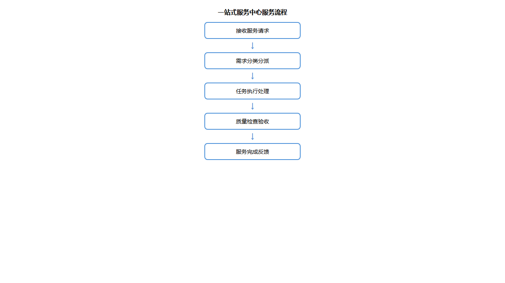
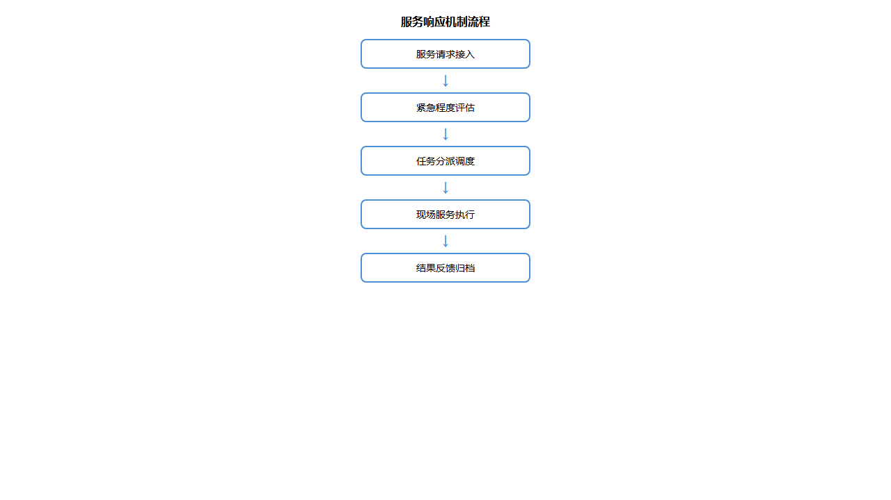

## 运行方案

### 服务流程设计

一站式服务中心建立标准化服务流程，确保每项服务请求得到及时、规范处理：

**流程说明：**

| 流程节点 | 操作内容 | 责任岗位 | 时限要求 |
|---------|---------|---------|---------|
| 接收请求 | 接听服务热线、录入工单信息 | 调度坐席 | ≤1分钟 |
| 分类分派 | 判断服务类型、分派至对应班组 | 调度坐席 | ≤2分钟 |
| 任务执行 | 现场服务执行、进度反馈 | 服务人员 | 按标准时限 |
| 质量验收 | 服务完成确认、质量检查 | 值班组长 | 服务完成后 |
| 反馈归档 | 客户回访、工单归档、数据分析 | 调度坐席 | 当日完成 |

### 响应机制

建立分级响应机制，根据服务紧急程度采取差异化处理策略：

**响应等级划分：**

| 响应等级 | 适用场景 | 响应时限 | 处理时限 |
|---------|---------|---------|---------|
| 紧急 | 设备故障影响医疗安全、突发事件 | 5分钟内响应 | 30分钟内到场 |
| 加急 | 影响正常医疗秩序的服务需求 | 10分钟内响应 | 1小时内到场 |
| 常规 | 日常清洁、一般维修等服务需求 | 30分钟内响应 | 按排班处理 |
| 计划性 | 定期保养、预防性维护等工作 | 预约安排 | 按计划执行 |

### 质量控制体系

建立三级质量控制体系，确保服务质量持续改进：

**第一级：过程控制**
- 服务过程全程录音录像
- 关键节点实时监控预警
- 异常情况即时干预处理

**第二级：检查考核**
- 每日服务工单抽查审核
- 每周服务质量分析会议
- 每月绩效考核评定

**第三级：持续改进**
- 客户满意度调查分析
- 服务流程优化建议
- 人员培训需求识别

### 信息化管理

服务中心采用信息化手段实现全流程管理：

| 管理环节 | 信息化手段 | 管理效果 |
|---------|-----------|---------|
| 工单管理 | 电子工单系统 | 工单全程可追溯 |
| 人员调度 | 智能排班系统 | 人力资源优化配置 |
| 质量监控 | 数据分析平台 | 问题及时发现改进 |
| 客户服务 | 满意度评价系统 | 服务质量持续提升 |

通过以上运行方案，一站式服务中心将为广汉市人民医院提供7×24小时不间断的后勤服务保障，确保医院各项后勤工作高效有序运转。
