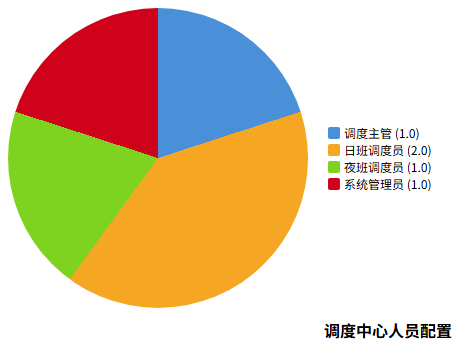
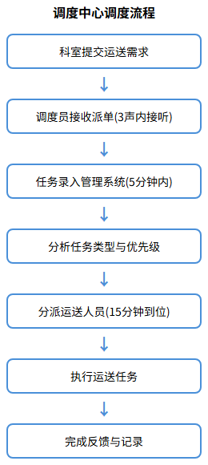
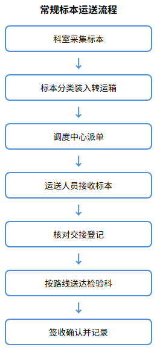
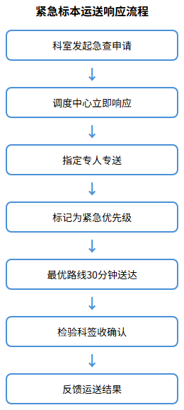
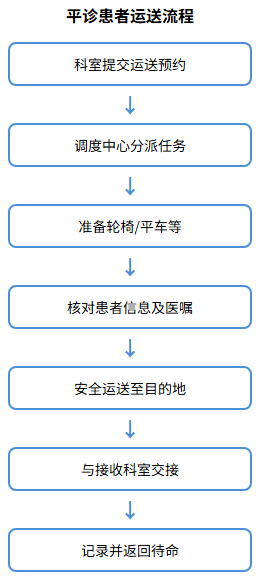
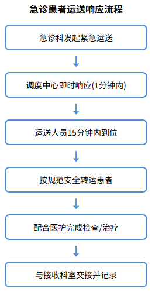
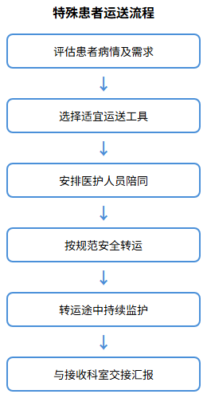

# 中央运输服务方案

## 调度中心组织架构管理

### 调度中心设置

针对广汉市人民医院后勤综合服务项目，我方设立中央调度中心作为医院运送服务的指挥中枢。调度中心位于医院后勤楼一层，配备专用调度工作区，设置24小时值班制度，全天候接收各科室运送需求。调度中心配置专用座机和移动电话，实行首问负责制，要求电话铃响3声内接听，确保5分钟内将运送需求录入管理系统并响应派单。

调度中心硬件配置包括：调度台3套（含双屏电脑）、数字对讲系统1套、智能运送管理系统1套、监控显示屏2台。软件系统实现与医院HIS/LIS/PACS系统对接，支持自动接收检验标本运送申请、患者检查预约等信息，实现任务自动派发和全程追踪。

### 人员配置

调度中心配置调度人员5名，具体岗位设置如下：

| 岗位名称 | 人数 | 工作时段 | 岗位职责 |
|---------|------|---------|---------|
| 调度主管 | 1人 | 行政班（8:00-12:00，14:00-17:30） | 全面负责调度中心管理、数据分析、质量监督 |
| 日班调度员 | 2人 | 8:00-20:00（轮班） | 接听电话、录入任务、分派运送人员、跟踪进度 |
| 夜班调度员 | 1人 | 20:00-次日8:00 | 夜间及节假日调度工作、紧急任务处理 |
| 系统管理员 | 1人 | 行政班（兼） | 系统维护、数据备份、故障处理 |

调度人员任职要求：大专及以上学历，身体健康，无犯罪前科，具有医院运送服务管理工作经验，熟练使用电脑、对讲机及智能手机操作系统，100%经过岗前培训并考核合格后方可上岗。

### 调度流程

调度中心采用"接收—分派—执行—反馈"四步闭环管理模式，具体流程如下：

**任务接收**：调度员接听科室电话或接收系统自动推送的运送需求，详细记录任务类型、起点科室、目的地、特殊要求等信息，5分钟内完成系统录入。

**任务分派**：系统根据任务类型、紧急程度、运送人员位置等因素智能匹配最优运送人员，调度员确认后通过系统或对讲机下达指令，运送人员15分钟内到达指定科室。

**任务执行**：运送人员到达后扫描任务单二维码确认接单，按规范完成运送任务，关键节点实时回传系统。

**任务反馈**：任务完成后运送人员确认签收，系统自动记录完成时间、运送时长等数据。调度员每日汇总分析任务完成率、及时率、科室分布等指标，为持续优化提供数据支撑。

## 标本运送方案

### 常规标本运送流程

常规标本运送覆盖全院各临床科室、检验科、病理科、输血科及核医学科。运送人员每日定时循环收取各科室标本，按标本类型分类装入专用转运箱，确保运送过程符合生物安全规范。

**运送时间安排**：

| 标本类型 | 收取频次 | 运送时效 | 备注 |
|---------|---------|---------|------|
| 常规血液标本 | 每日3次（9:00、11:00、15:00） | 收取后30分钟内送达 | 覆盖全院住院科室 |
| 尿液/粪便标本 | 每日2次（9:00、15:00） | 收取后30分钟内送达 | 与血液标本同步运送 |
| 病理标本 | 每日2次（12:00前、17:00前） | 按时段准时送达 | 手术室/内镜中心标本 |
| 体检中心标本 | 每日2-3趟 | 高峰期增加频次 | 根据体检人数动态调整 |
| 血培养瓶/空气培养皿 | 按需即时运送 | 接单后15分钟内送达 | 检验科配送至科室 |

运送人员接收标本时严格执行核对制度，核对项目包括：标本类型、数量、科室名称、申请单号等，双方签字确认交接记录。标本运送必须使用医院提供的规范转运箱，恒温标本使用专用恒温转运箱，确保标本质量不受运送影响。

### 紧急标本运送响应机制

针对急查标本建立快速响应机制，确保急查标本30分钟内送达检验科。具体响应流程如下：

**即时响应**：科室发起急查申请后，调度中心立即识别为紧急任务，优先级设为最高，中断当前非紧急派单，指定专人专送。

**专人专送**：急查标本由专人负责，采用点对点直送模式，不经过中间环节，选择最优路线确保最短时间送达。运送过程中保持与调度中心通讯畅通，实时报告位置信息。

**签收确认**：运送人员将急查标本送达检验科后，与检验科工作人员当面核对签收，系统自动记录运送时长，超时自动预警。

**急查标本响应时效要求**：

| 任务类型 | 响应时限 | 送达时限 | 考核标准 |
|---------|---------|---------|---------|
| 急查血液标本 | 1分钟内响应 | 30分钟内送达 | 超时率≤2% |
| 急查体液标本 | 1分钟内响应 | 30分钟内送达 | 超时率≤2% |
| 术中快速病理 | 即时响应 | 15分钟内送达 | 零超时 |
| 危急值标本 | 即时响应 | 最短时间送达 | 专人专送 |

调度中心每月统计急查标本运送数据，分析超时原因，持续优化运送路线和人员配置，确保急查标本运送时效持续达标。

## 患者运送方案

### 平诊患者运送

平诊患者运送服务覆盖全院住院科室，包括预约检查运送、转科运送、入院陪送等。运送人员根据医院陪检预约系统接收任务，提前了解患者病情及检查要求，选择适宜的运送工具（轮椅或平车），确保运送安全舒适。

**运送服务类型及要求**：

| 服务类型 | 响应时限 | 服务标准 | 注意事项 |
|---------|---------|---------|---------|
| 预约检查运送 | 按预约时间提前15分钟到达 | 核对患者信息及检查单 | 与科室护士交接确认 |
| 加急检查运送 | 接单后15分钟内到达 | 优先安排运送 | 与医技科室协调排队 |
| 转科运送 | 接单后20分钟内完成 | 确保患者安全转运 | 携带完整病历资料 |
| 入院陪送 | 按入院服务中心安排 | 全程陪同至病房 | 介绍病房环境及注意事项 |

运送患者前严格执行核查制度，将检查单信息与患者手腕带信息逐一核对，杜绝错接患者。运送过程中根据患者病情选择合适体位，保持平稳行进，避免颠簸。到达目的地后与接收科室医护人员共同安置患者，汇报运送情况并做好交接记录。

### 急诊患者运送

急诊患者运送建立快速响应机制，确保急查患者运送15分钟内到达需求科室。急诊运送实行24小时待命制度，运送人员随时处于待命状态，接到调度指令后立即响应。

**院前急救运送**：运送人员接到指令后迅速随救护车出诊，按规范使用担架、轮椅、铲式担架等设备，根据患者伤情调整搬运姿势，避免二次伤害。协助医护人员将患者从现场安全转移至急救车，转运途中固定好担架，防止急刹车、颠簸导致患者移位，密切观察患者状态，发现异常及时告知医护人员。

**院内急诊转运**：患者到院后，运送人员协助将患者从急救车平稳转运至急诊室、检查室或手术室，与院内医护人员交接患者基本情况。运送结束后及时清洁消毒救护车、担架、轮椅等设备，协助补充救护车物资，确保设备处于备用状态。

**急诊运送响应时效**：

| 任务类型 | 响应时限 | 到达时限 | 考核标准 |
|---------|---------|---------|---------|
| 急诊患者运送 | 1分钟内响应 | 15分钟内到位 | 超时率≤1% |
| 120急救出诊 | 即时响应 | 最短时间出车 | 零延误 |
| 急诊检查运送 | 即时响应 | 15分钟内到达 | 超时率≤1% |
| 手术患者转运 | 即时响应 | 按手术时间准时 | 零延误 |

### 特殊患者运送

针对危重患者、术后患者、脊柱损伤患者等特殊群体，制定专项运送方案，确保运送安全。

**危重患者运送**：运送前评估患者生命体征，与医护人员充分沟通运送风险。安排医护人员全程陪同，携带应急仪器（监护仪、吸氧装置、呼吸气囊）和急救药品。运送过程中固定好各种引流管，确保管道、静脉通道畅通，密切观察患者病情变化，发现异常立即报告并配合抢救。

**脊柱损伤患者**：使用铲式担架或脊柱固定板，保持患者脊柱轴线稳定，避免弯曲、扭转。至少3人协同搬运，动作轻柔平稳，全程保持患者体位固定。

**术后患者运送**：根据手术类型和麻醉方式选择运送工具和体位，保持引流管通畅，注意保暖，观察伤口敷料情况，与病房护士详细交接术中情况。

**特殊患者运送管理要求**：

| 患者类型 | 运送工具 | 人员配置 | 特殊要求 |
|---------|---------|---------|---------|
| 危重患者 | 平车 | 医护陪同+运送人员 | 携带应急设备和药品 |
| 脊柱损伤 | 铲式担架 | 至少3人协同 | 保持脊柱轴线稳定 |
| 术后患者 | 平车 | 运送人员 | 注意引流管通畅 |
| 骨折患者 | 平车/轮椅 | 运送人员 | 固定患肢，避免二次伤害 |
| 儿科患者 | 轮椅/平车 | 家属陪同+运送人员 | 安抚情绪，注意安全 |

运送人员定期接受特殊患者运送专项培训，熟练掌握各类患者运送技能和应急处理能力，确保特殊患者运送安全零事故。
