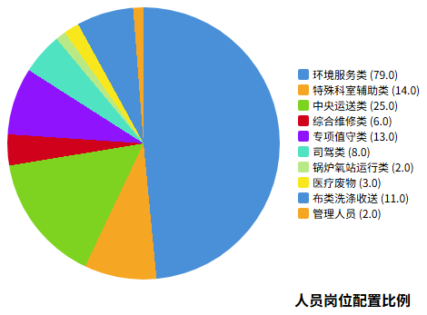

# 人员配置方案

## 人员岗位人数配置

### 方案目标

本项目人员配置方案以满足医院后勤综合服务需求为核心目标，依据招标文件要求及医院实际服务面积、工作量测算，配置不少于163名服务人员。方案遵循"定员定岗定编"原则，确保各岗位人员数量充足、职责明确、技能达标，为医院提供全方位、高质量的后勤保障服务。

人员配置坚持以下原则：一是按需配置，根据各科室服务需求和工作量合理分配人员；二是专业对口，确保特种作业人员持证上岗；三是动态调整，根据采购人科室变动情况及时响应调整；四是质量优先，所有人员100%经过岗前培训合格方可上岗。

### 岗位分类与人数配置

本项目服务人员按照岗位类别划分为十大类，具体配置如下：

| 岗位类别 | 岗位名称 | 配置人数 | 占比 |
|---------|---------|---------|------|
| 管理人员 | 项目管理 | 2人 | 1.2% |
| 环境服务类 | 清洁工、医辅/护工 | 79人 | 48.5% |
| 特殊科室辅助类 | 医辅/护工 | 14人 | 8.6% |
| 中央运送类 | 氧工、搬运工、担架工、病人运送、药品运送、调度员 | 25人 | 15.3% |
| 综合维修类 | 水、电、木工等 | 6人 | 3.7% |
| 专项值守类 | 消控室、门卫 | 13人 | 8.0% |
| 司驾类 | 急救车司机 | 8人 | 4.9% |
| 锅炉/氧站运行类 | 司炉工、液氧站管理员 | 2人 | 1.2% |
| 医疗废物 | 医废暂存间管理、污水站管理、全院收运 | 3人 | 1.8% |
| 布类洗涤收送 | 洗浆房工人、消毒供应室工人 | 11人 | 6.8% |
| **合计** | - | **163人** | **100%** |

### 各岗位职责说明

**管理人员（2人）**：项目经理全面负责本项目的日常运营管理、人员调配、质量监督及与采购人的沟通协调工作。项目经理须长期驻点采购人院区，具有三级医院物业管理项目三年以上管理经验，更换须经采购人后勤部门负责人同意。

**环境服务类（79人）**：负责全院环境清洁消毒、绿化养护、消杀服务等工作。包括门诊、住院病区、公共区域的日常清洁保洁，环境消毒消杀，医疗废物收集转运等。其中至少32人为男性60岁以下、女性55岁以下，至少1人具有高处作业特种作业操作证。

**特殊科室辅助类（14人）**：专门服务于手术室（6人，年龄45岁以下）、内镜中心（2人，负责洗镜工作）、儿科（1人，60岁以下，中学及以上文化程度）、ICU（5人，60岁以下，小学及以上文化程度）等特殊科室，提供保洁、运送、清洗辅助等专业服务。

**中央运送类（25人）**：包括氧工及搬运工（4人）、担架工（6人）、病人运送及陪检（10人）、药品运送及即时运送（4人）、调度员（1人）。负责全院标本运送、患者运送、药品配送、物资运送等中央运输服务。调度员须大专及以上文化，熟悉智能手机及系统操作、电脑操作熟练。

**综合维修类（6人）**：负责医院水电维修、木工作业等综合维修服务。电工须持有特种作业操作证（低压或高压电工作业），其中至少3名为高压电工作业。至少1人具备焊接与热切割作业证。参与水电班组全面排班，含夜班值守。

**专项值守类（13人）**：消控室值守人员（6人）须具有四级（中级）或以上消防设施操作员职业资格证，负责消防控制室24小时值守。门卫（7人）负责医院门岗值守、出入管理、安全巡查等工作。

**司驾类（8人）**：急救车司机须持有C1及以上汽车驾驶证，具有3年及以上汽车驾驶工作经验或3年及以上120救护车驾驶经验，年龄男性60岁以下，无犯罪记录，品行端正。

**锅炉/氧站运行类（2人）**：负责热水锅炉系统运行维护、医用中心制氧站医气系统及医气钢瓶运行维护管理。人员年龄男性55岁以下，须取得相关岗位资质证书。

**医疗废物管理类（3人）**：负责医疗废物暂存间管理、污水站管理及医疗废物全院收运转运工作。管理岗位1人需50岁以下，高中/中专以上文化程度。人员年龄男性60岁以下、女性55岁以下比例不低于90%。

**布类洗涤收送类（11人）**：洗浆房工人（8人）负责全院布类织物的洗涤、收送工作。消毒供应室工人（3人）负责消毒供应中心的器械清洗消毒、灭菌物品收送等工作。

