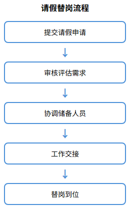
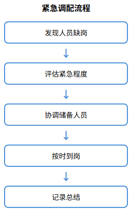
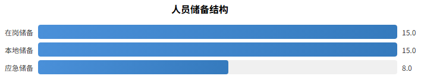

## 人员替代机制

### 机制目标

人员替代机制旨在确保医院后勤服务的连续性和稳定性，建立完善的请假替岗、紧急调配和人员储备体系。通过科学的人员梯队建设和灵活的调配机制，确保任何情况下各岗位服务不中断、质量不降低，满足医院24小时不间断服务需求。

机制建设遵循以下原则：一是及时性原则，人员替代响应迅速，确保服务无缝衔接；二是专业性原则，替代人员须具备相应岗位技能和资质；三是充足性原则，保持充足的人员储备应对各种情况；四是规范性原则，替代流程规范有序，责任明确。

### 请假替岗机制

建立规范的请假审批和替岗安排流程，确保日常人员变动不影响服务：

| 请假类型 | 审批权限 | 替岗安排 | 响应时限 |
|---------|---------|---------|---------|
| 事假（1天以内） | 班组长审批 | 班组内部调休或替岗 | 提前24小时申请 |
| 事假（1-3天） | 项目经理审批 | 班组内部调配或储备人员顶岗 | 提前48小时申请 |
| 病假 | 项目经理审批 | 储备人员顶岗 | 及时报告，即时安排 |
| 婚假、产假等长假 | 公司审批 | 储备人员或新招人员顶岗 | 提前7天申请 |

**替岗安排流程：**

| 步骤 | 责任人 | 工作内容 | 时限要求 |
|------|--------|---------|---------|
| 申请 | 请假人员 | 提交书面请假申请，说明请假事由、时间 | 按规定提前申请 |
| 审批 | 班组长/项目经理 | 审核请假申请，评估替岗需求 | 收到申请后4小时内 |
| 安排 | 项目经理 | 协调储备人员或安排班组内替岗 | 审批通过后2小时内 |
| 交接 | 请假人员与替岗人员 | 工作交接，交代注意事项 | 上岗前完成 |
| 到岗 | 替岗人员 | 按时到岗，履行岗位职责 | 请假生效时同步 |

### 紧急调配机制

针对突发情况建立紧急人员调配机制，确保紧急状态下服务保障到位：

**紧急情况分类及响应：**

| 紧急类型 | 触发条件 | 响应措施 | 到岗时限 |
|---------|---------|---------|---------|
| 突发公共卫生事件 | 传染病疫情、食物中毒等 | 启动应急预案，全员待命，重点岗位增派人员 | 1小时内 |
| 大型突发情况 | 大型交通事故、群体伤亡事件 | 急救车司机、担架工全员到岗，其他岗位人员支援 | 30分钟内 |
| 自然灾害 | 地震、洪水、极端天气 | 启动应急响应，确保关键岗位人员到岗 | 2小时内 |
| 设施设备故障 | 停电、停水、管道爆裂 | 维修人员即时到场，必要时增派支援 | 30分钟内 |
| 人员批量缺岗 | 多人同时请假或离职 | 储备人员顶岗，必要时临时招聘 | 4小时内 |

**紧急调配流程：**

| 步骤 | 责任人 | 工作内容 |
|------|--------|---------|
| 报告 | 发现人员/班组长 | 立即报告项目经理，说明情况 |
| 评估 | 项目经理 | 评估紧急程度、所需人员数量和技能要求 |
| 调配 | 项目经理 | 协调储备人员、调配其他班组人员支援 |
| 到岗 | 被调配人员 | 按要求时限到达指定岗位 |
| 记录 | 项目经理 | 记录调配情况，事后总结改进 |

### 人员储备机制

建立多层次人员储备体系，确保人员供给充足、响应及时：

**储备人员配置：**

| 储备类型 | 储备人数 | 储备来源 | 适用岗位 |
|---------|---------|---------|---------|
| 在岗储备 | 每岗位1-2人 | 现有员工多技能培训 | 各岗位交叉替岗 |
| 本地储备 | 10-15人 | 劳务派遣公司合作、本地招聘 | 所有岗位 |
| 应急储备 | 5-8人 | 劳务派遣公司紧急协议 | 环境服务类、中央运送类 |

**储备人员管理要求：**

| 管理项目 | 具体要求 |
|---------|---------|
| 人员筛选 | 储备人员须满足岗位基本要求，通过背景审查和健康体检 |
| 培训管理 | 储备人员须完成岗前培训，定期参加在岗培训，保持技能达标 |
| 信息更新 | 每月更新储备人员信息库，确保联系方式有效、人员状态准确 |
| 定期演练 | 每季度组织一次替岗演练，检验储备人员响应速度和工作能力 |
| 激励机制 | 储备人员享受待岗补贴，替岗期间享受相应岗位工资待遇 |

### 人员撤换机制

对于不能胜任岗位工作要求的人员，建立规范的撤换流程：

| 步骤 | 责任人 | 工作内容 | 时限要求 |
|------|--------|---------|---------|
| 评估 | 采购人/项目经理 | 评估人员工作表现，确认不胜任岗位要求 | 持续评估 |
| 通知 | 采购人 | 书面通知中标人撤换要求 | 即时 |
| 响应 | 中标人 | 接到通知后安排符合要求的人员替换 | 7日内完成 |
| 交接 | 被撤换人员与替换人员 | 工作交接，确保服务连续 | 撤换前完成 |
| 到岗 | 替换人员 | 按时到岗，履行岗位职责 | 撤换生效时同步 |

### 人员稳定性保障措施

为确保项目人员稳定，保障服务连续性，采取以下措施：

| 保障措施 | 具体内容 |
|---------|---------|
| 薪酬保障 | 服务人员工资收入不低于德阳市政府当年最低工资标准，按时足额发放 |
| 社会保障 | 依法为全体员工缴纳社会保险，建立合法劳资关系 |
| 职业发展 | 建立员工晋升通道，优秀员工可晋升为班组长、主管 |
| 技能培训 | 定期开展技能培训，提升员工专业能力和职业素养 |
| 人文关怀 | 关注员工身心健康，组织团建活动，增强团队凝聚力 |
| 劳动保护 | 提供必要的劳动保护用品，保障员工职业健康安全 |

通过以上人员替代机制的建立和完善，确保本项目后勤服务人员配置充足、响应及时、保障有力，为医院提供优质、连续、稳定的后勤服务保障。
