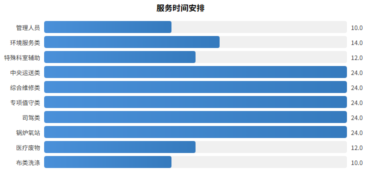
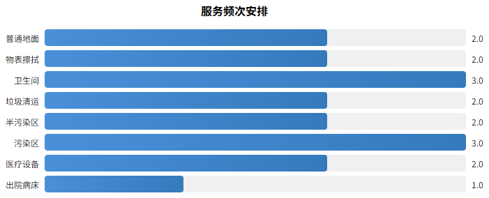
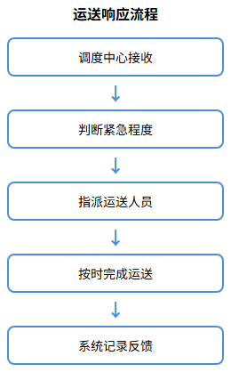

# 人员配置方案

## 人员岗位人数配置

### 方案目标

本项目人员配置方案以满足医院后勤综合服务需求为核心目标，依据招标文件要求及医院实际服务面积、工作量测算，配置不少于163名服务人员。方案遵循"定员定岗定编"原则，确保各岗位人员数量充足、职责明确、技能达标，为医院提供全方位、高质量的后勤保障服务。

人员配置坚持以下原则：一是按需配置，根据各科室服务需求和工作量合理分配人员；二是专业对口，确保特种作业人员持证上岗；三是动态调整，根据采购人科室变动情况及时响应调整；四是质量优先，所有人员100%经过岗前培训合格方可上岗。

### 岗位分类与人数配置

本项目服务人员按照岗位类别划分为十大类，具体配置如下：

| 岗位类别 | 岗位名称 | 配置人数 | 占比 |
|---------|---------|---------|------|
| 管理人员 | 项目管理 | 2人 | 1.2% |
| 环境服务类 | 清洁工、医辅/护工 | 79人 | 48.5% |
| 特殊科室辅助类 | 医辅/护工 | 14人 | 8.6% |
| 中央运送类 | 氧工、搬运工、担架工、病人运送、药品运送、调度员 | 25人 | 15.3% |
| 综合维修类 | 水、电、木工等 | 6人 | 3.7% |
| 专项值守类 | 消控室、门卫 | 13人 | 8.0% |
| 司驾类 | 急救车司机 | 8人 | 4.9% |
| 锅炉/氧站运行类 | 司炉工、液氧站管理员 | 2人 | 1.2% |
| 医疗废物 | 医废暂存间管理、污水站管理、全院收运 | 3人 | 1.8% |
| 布类洗涤收送 | 洗浆房工人、消毒供应室工人 | 11人 | 6.8% |
| **合计** | - | **163人** | **100%** |

### 各岗位职责说明

**管理人员（2人）**：项目经理全面负责本项目的日常运营管理、人员调配、质量监督及与采购人的沟通协调工作。项目经理须长期驻点采购人院区，具有三级医院物业管理项目三年以上管理经验，更换须经采购人后勤部门负责人同意。

**环境服务类（79人）**：负责全院环境清洁消毒、绿化养护、消杀服务等工作。包括门诊、住院病区、公共区域的日常清洁保洁，环境消毒消杀，医疗废物收集转运等。其中至少32人为男性60岁以下、女性55岁以下，至少1人具有高处作业特种作业操作证。

**特殊科室辅助类（14人）**：专门服务于手术室（6人，年龄45岁以下）、内镜中心（2人，负责洗镜工作）、儿科（1人，60岁以下，中学及以上文化程度）、ICU（5人，60岁以下，小学及以上文化程度）等特殊科室，提供保洁、运送、清洗辅助等专业服务。

**中央运送类（25人）**：包括氧工及搬运工（4人）、担架工（6人）、病人运送及陪检（10人）、药品运送及即时运送（4人）、调度员（1人）。负责全院标本运送、患者运送、药品配送、物资运送等中央运输服务。调度员须大专及以上文化，熟悉智能手机及系统操作、电脑操作熟练。

**综合维修类（6人）**：负责医院水电维修、木工作业等综合维修服务。电工须持有特种作业操作证（低压或高压电工作业），其中至少3名为高压电工作业。至少1人具备焊接与热切割作业证。参与水电班组全面排班，含夜班值守。

**专项值守类（13人）**：消控室值守人员（6人）须具有四级（中级）或以上消防设施操作员职业资格证，负责消防控制室24小时值守。门卫（7人）负责医院门岗值守、出入管理、安全巡查等工作。

**司驾类（8人）**：急救车司机须持有C1及以上汽车驾驶证，具有3年及以上汽车驾驶工作经验或3年及以上120救护车驾驶经验，年龄男性60岁以下，无犯罪记录，品行端正。

**锅炉/氧站运行类（2人）**：负责热水锅炉系统运行维护、医用中心制氧站医气系统及医气钢瓶运行维护管理。人员年龄男性55岁以下，须取得相关岗位资质证书。

**医疗废物管理类（3人）**：负责医疗废物暂存间管理、污水站管理及医疗废物全院收运转运工作。管理岗位1人需50岁以下，高中/中专以上文化程度。人员年龄男性60岁以下、女性55岁以下比例不低于90%。

**布类洗涤收送类（11人）**：洗浆房工人（8人）负责全院布类织物的洗涤、收送工作。消毒供应室工人（3人）负责消毒供应中心的器械清洗消毒、灭菌物品收送等工作。

## 普通特殊科室人数方案

### 配置依据

科室人员配置以医院科室功能分类、服务面积、工作量及院感风险等级为依据。普通科室按照标准化配置方案执行，特殊科室根据其专业特性、感染风险等级及服务频次要求进行专项配置，确保各科室服务质量达标。

配置遵循以下标准：普通科室按照床位数与人员比例配置，特殊科室在此基础上增加人员配比；高风险科室配备专职人员，避免跨科调配；重点科室实行双岗备份，确保服务连续性。

### 普通科室人数配置方案

普通科室包括普通门诊、普通住院病区、行政办公区、公共区域等，按照服务面积和工作量进行标准化配置：

| 科室类型 | 服务区域 | 配置人数 | 配置标准 |
|---------|---------|---------|---------|
| 普通门诊 | 各门诊诊室、候诊区、收费窗口 | 15人 | 每楼层2-3人，按门诊量动态调整 |
| 普通住院病区 | 各内科、外科、妇产科等普通病房 | 35人 | 每病区2-3人，按床位数配比 |
| 行政办公区 | 行政楼、后勤办公区 | 6人 | 每栋楼1-2人 |
| 公共区域 | 门诊大厅、走廊、电梯、卫生间 | 12人 | 按区域面积和人流密度配置 |
| 医技科室 | 检验科、放射科、功能检查科等 | 11人 | 每科室1-2人 |
| **小计** | - | **79人** | - |

普通科室人员工作时间实行两班制，早班6:30-17:30，中班13:30-21:00。中午安排轮班值班，确保服务不断档。晚间21:00后预留应急人员，电话通知15分钟内到岗处置应急保洁工作。

### 特殊科室人数配置方案

特殊科室因感染风险高、操作要求严格、服务频次密集，实行专项人员配置：

| 特殊科室 | 配置人数 | 人员要求 | 主要职责 |
|---------|---------|---------|---------|
| 手术室 | 6人 | 年龄45岁以下，身体健康，100%经岗前培训合格 | 术前术后环境清洁消毒、手术器械初步处理、污物处理、无菌物品传递 |
| 内镜中心 | 2人 | 身体健康，具备洗镜专业技能 | 内镜清洗消毒、诊疗环境清洁、器械维护保养 |
| 儿科 | 1人 | 60岁以下，中学及以上文化程度 | 病区环境清洁消毒、患儿用品清洁、配合院感防控 |
| ICU | 5人 | 60岁以下，小学及以上文化程度 | 重症病区环境清洁消毒、患者生活护理辅助、医疗废物处理 |
| **小计** | **14人** | - | - |

特殊科室人员配置特点：一是人员素质要求高，需具备无菌观念和隔离知识；二是工作标准严格，按照科室特殊要求及操作规程执行；三是培训要求强化，除岗前培训外，需定期参加感染知识培训、职业暴露防护培训；四是管理要求严格，进入特殊区域须遵循相应科室管理规范，服从科室负责人统筹安排。

### 人员配置动态调整机制

采购人有权根据实际情况调整服务人员人数，如科室变动、服务范围变化等原因，以采购人书面告知为准，中标人无条件响应。调整机制包括：

| 调整类型 | 触发条件 | 响应时限 | 调整方式 |
|---------|---------|---------|---------|
| 科室增减 | 采购人科室新建、合并或撤销 | 收到书面通知后7日内 | 相应增减对应岗位人员 |
| 工作量变化 | 科室床位增减、门诊量显著变化 | 收到书面通知后7日内 | 按比例调整人员配置 |
| 临时需求 | 大型检查、创建活动、突发公共卫生事件 | 即时响应 | 统筹调配现有人员或增派临时人员 |
| 人员撤换 | 采购人认为人员不能胜任岗位要求 | 接到通知后7日内 | 更换符合岗位要求的人员 |

所有调整均需保证服务质量不降低，调整后的人员须满足相应岗位的资质要求和培训要求，确保医院后勤服务的连续性和稳定性。

## 服务时间频次方案

### 服务时间总体安排

本项目服务时间安排以满足医院24小时不间断服务需求为目标，根据各岗位工作特点和医院运营规律，实行弹性工作制和轮班制相结合的排班模式。确保各时段服务覆盖到位，重点时段人员配置充足，突发情况响应及时。

服务时间安排遵循以下原则：一是全覆盖原则，确保24小时服务不断档；二是弹性原则，根据医院人流高峰和低谷灵活调配；三是合规原则，严格遵守劳动法规，保障员工休息权益；四是应急原则，预留应急人员随时待命。

### 各岗位服务时间安排

| 岗位类别 | 服务时间 | 班次安排 | 备注 |
|---------|---------|---------|------|
| 管理人员 | 8:00-18:00 | 常白班，24小时电话值班 | 项目经理驻点，重大事项随时到岗 |
| 环境服务类 | 6:30-21:00 | 早班6:30-17:30，中班13:30-21:00 | 中午轮班值班，晚间预留应急人员 |
| 特殊科室辅助类 | 7:00-19:00 | 根据科室诊疗时间安排 | 手术室根据手术安排弹性调整 |
| 中央运送类 | 7×24小时 | 三班制，每班8小时 | 调度中心7×24小时运行 |
| 综合维修类 | 7×24小时 | 两班制，含夜班值守 | 紧急维修30分钟内到场 |
| 专项值守类 | 7×24小时 | 三班制，每班8小时 | 消控室、门卫24小时在岗 |
| 司驾类 | 7×24小时 | 轮班待命 | 急救车司机随时出车 |
| 锅炉/氧站运行类 | 7×24小时 | 轮班值守 | 重点设备24小时监控 |
| 医疗废物管理类 | 7:00-19:00 | 两班制 | 上午、下午各收运一次 |
| 布类洗涤收送类 | 7:30-17:30 | 常白班 | 按科室需求定时收送 |

### 重点时段人员配置

根据医院运营规律，以下时段为重点服务时段，需加强人员配置：

| 重点时段 | 时间范围 | 加强措施 |
|---------|---------|---------|
| 晨间清洁高峰 | 6:30-8:30 | 环境服务类全员到岗，重点完成病区晨间清洁消毒 |
| 门诊高峰时段 | 8:00-11:30 | 门诊区域增加巡回保洁人员，公共区域增加保洁频次 |
| 午间服务保障 | 11:30-14:00 | 安排轮班值班，确保服务不断档 |
| 下午诊疗高峰 | 14:00-17:00 | 各区域保持标准配置，重点区域增加人员 |
| 夜间应急保障 | 21:00-次日6:30 | 预留应急人员，电话通知15分钟内到岗 |

### 服务频次安排

根据医院各区域功能特点和院感管理要求，制定差异化服务频次标准：

**普通区域服务频次：**

| 服务项目 | 服务频次 | 服务标准 |
|---------|---------|---------|
| 地面清洁 | 每日2次全面清扫，2次拖抹消毒 | 无垃圾杂物、无污渍、地面干燥 |
| 物表擦拭 | 每日2次全面清抹消毒 | 无积尘、无污渍、消毒达标 |
| 卫生间清洁 | 每日3次全面清洁，每2小时巡回保洁 | 无异味、无积水、用品充足 |
| 垃圾清运 | 每日2次定时收集 | 垃圾桶不满溢、分类规范 |

**临床科室服务频次：**

| 服务项目 | 服务频次 | 服务标准 |
|---------|---------|---------|
| 半污染区清洁消毒 | 每日2次全面清洁消毒，其余时间巡回保洁 | 按医务人员要求及时消毒 |
| 污染区清洁消毒 | 每日3次全面清洁消毒，其余时间巡回保洁 | 按医务人员要求及时清洁消毒 |
| 医疗设备表面清洁 | 每日2次 | 在医护人员协助下进行 |
| 出院病床单元 | 即时全面清洁消毒 | 患者出院后立即执行 |

**特殊科室服务频次：**

| 服务项目 | 服务频次 | 服务标准 |
|---------|---------|---------|
| 手术室清洁 | 每台手术前后即时清洁消毒 | 按手术室规范执行 |
| ICU清洁消毒 | 每日3次以上，随时响应 | 严格无菌操作 |
| 内镜清洗消毒 | 每次使用后即时清洗消毒 | 按内镜清洗消毒技术规范执行 |
| 血透室清洁 | 每次透析前后清洁消毒 | 按血透室管理规范执行 |

### 中央运送服务时间频次

中央运送服务实行7×24小时调度，各类型运送服务频次安排如下：

| 运送类型 | 服务时间 | 响应时限 | 运送频次 |
|---------|---------|---------|---------|
| 标本运送 | 7:00-18:00常规，18:00-次日7:00紧急 | 常规30分钟内，紧急15分钟内 | 每日3-4次定时收运，紧急随叫随到 |
| 患者运送 | 7×24小时 | 平诊30分钟内，急诊15分钟内 | 按诊疗安排实时响应 |
| 药品运送 | 8:00-18:00常规，其余紧急 | 常规30分钟内，紧急15分钟内 | 每日3-4次定时配送，紧急随叫随到 |
| 物资运送 | 8:00-17:30 | 60分钟内 | 按科室需求定时配送 |

## 人员替代机制

### 机制目标

人员替代机制旨在确保医院后勤服务的连续性和稳定性，建立完善的请假替岗、紧急调配和人员储备体系。通过科学的人员梯队建设和灵活的调配机制，确保任何情况下各岗位服务不中断、质量不降低，满足医院24小时不间断服务需求。

机制建设遵循以下原则：一是及时性原则，人员替代响应迅速，确保服务无缝衔接；二是专业性原则，替代人员须具备相应岗位技能和资质；三是充足性原则，保持充足的人员储备应对各种情况；四是规范性原则，替代流程规范有序，责任明确。

### 请假替岗机制

建立规范的请假审批和替岗安排流程，确保日常人员变动不影响服务：

| 请假类型 | 审批权限 | 替岗安排 | 响应时限 |
|---------|---------|---------|---------|
| 事假（1天以内） | 班组长审批 | 班组内部调休或替岗 | 提前24小时申请 |
| 事假（1-3天） | 项目经理审批 | 班组内部调配或储备人员顶岗 | 提前48小时申请 |
| 病假 | 项目经理审批 | 储备人员顶岗 | 及时报告，即时安排 |
| 婚假、产假等长假 | 公司审批 | 储备人员或新招人员顶岗 | 提前7天申请 |

**替岗安排流程：**

| 步骤 | 责任人 | 工作内容 | 时限要求 |
|------|--------|---------|---------|
| 申请 | 请假人员 | 提交书面请假申请，说明请假事由、时间 | 按规定提前申请 |
| 审批 | 班组长/项目经理 | 审核请假申请，评估替岗需求 | 收到申请后4小时内 |
| 安排 | 项目经理 | 协调储备人员或安排班组内替岗 | 审批通过后2小时内 |
| 交接 | 请假人员与替岗人员 | 工作交接，交代注意事项 | 上岗前完成 |
| 到岗 | 替岗人员 | 按时到岗，履行岗位职责 | 请假生效时同步 |

### 紧急调配机制

针对突发情况建立紧急人员调配机制，确保紧急状态下服务保障到位：

**紧急情况分类及响应：**

| 紧急类型 | 触发条件 | 响应措施 | 到岗时限 |
|---------|---------|---------|---------|
| 突发公共卫生事件 | 传染病疫情、食物中毒等 | 启动应急预案，全员待命，重点岗位增派人员 | 1小时内 |
| 大型突发情况 | 大型交通事故、群体伤亡事件 | 急救车司机、担架工全员到岗，其他岗位人员支援 | 30分钟内 |
| 自然灾害 | 地震、洪水、极端天气 | 启动应急响应，确保关键岗位人员到岗 | 2小时内 |
| 设施设备故障 | 停电、停水、管道爆裂 | 维修人员即时到场，必要时增派支援 | 30分钟内 |
| 人员批量缺岗 | 多人同时请假或离职 | 储备人员顶岗，必要时临时招聘 | 4小时内 |

**紧急调配流程：**

| 步骤 | 责任人 | 工作内容 |
|------|--------|---------|
| 报告 | 发现人员/班组长 | 立即报告项目经理，说明情况 |
| 评估 | 项目经理 | 评估紧急程度、所需人员数量和技能要求 |
| 调配 | 项目经理 | 协调储备人员、调配其他班组人员支援 |
| 到岗 | 被调配人员 | 按要求时限到达指定岗位 |
| 记录 | 项目经理 | 记录调配情况，事后总结改进 |

### 人员储备机制

建立多层次人员储备体系，确保人员供给充足、响应及时：

**储备人员配置：**

| 储备类型 | 储备人数 | 储备来源 | 适用岗位 |
|---------|---------|---------|---------|
| 在岗储备 | 每岗位1-2人 | 现有员工多技能培训 | 各岗位交叉替岗 |
| 本地储备 | 10-15人 | 劳务派遣公司合作、本地招聘 | 所有岗位 |
| 应急储备 | 5-8人 | 劳务派遣公司紧急协议 | 环境服务类、中央运送类 |

**储备人员管理要求：**

| 管理项目 | 具体要求 |
|---------|---------|
| 人员筛选 | 储备人员须满足岗位基本要求，通过背景审查和健康体检 |
| 培训管理 | 储备人员须完成岗前培训，定期参加在岗培训，保持技能达标 |
| 信息更新 | 每月更新储备人员信息库，确保联系方式有效、人员状态准确 |
| 定期演练 | 每季度组织一次替岗演练，检验储备人员响应速度和工作能力 |
| 激励机制 | 储备人员享受待岗补贴，替岗期间享受相应岗位工资待遇 |

### 人员撤换机制

对于不能胜任岗位工作要求的人员，建立规范的撤换流程：

| 步骤 | 责任人 | 工作内容 | 时限要求 |
|------|--------|---------|---------|
| 评估 | 采购人/项目经理 | 评估人员工作表现，确认不胜任岗位要求 | 持续评估 |
| 通知 | 采购人 | 书面通知中标人撤换要求 | 即时 |
| 响应 | 中标人 | 接到通知后安排符合要求的人员替换 | 7日内完成 |
| 交接 | 被撤换人员与替换人员 | 工作交接，确保服务连续 | 撤换前完成 |
| 到岗 | 替换人员 | 按时到岗，履行岗位职责 | 撤换生效时同步 |

### 人员稳定性保障措施

为确保项目人员稳定，保障服务连续性，采取以下措施：

| 保障措施 | 具体内容 |
|---------|---------|
| 薪酬保障 | 服务人员工资收入不低于德阳市政府当年最低工资标准，按时足额发放 |
| 社会保障 | 依法为全体员工缴纳社会保险，建立合法劳资关系 |
| 职业发展 | 建立员工晋升通道，优秀员工可晋升为班组长、主管 |
| 技能培训 | 定期开展技能培训，提升员工专业能力和职业素养 |
| 人文关怀 | 关注员工身心健康，组织团建活动，增强团队凝聚力 |
| 劳动保护 | 提供必要的劳动保护用品，保障员工职业健康安全 |

通过以上人员替代机制的建立和完善，确保本项目后勤服务人员配置充足、响应及时、保障有力，为医院提供优质、连续、稳定的后勤服务保障。
