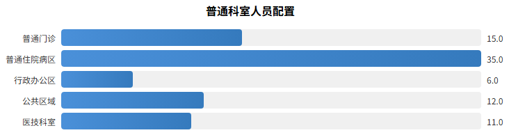
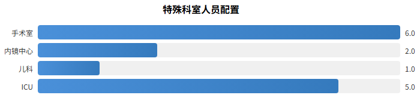
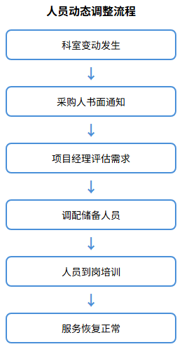

## 普通特殊科室人数方案

### 配置依据

科室人员配置以医院科室功能分类、服务面积、工作量及院感风险等级为依据。普通科室按照标准化配置方案执行，特殊科室根据其专业特性、感染风险等级及服务频次要求进行专项配置，确保各科室服务质量达标。

配置遵循以下标准：普通科室按照床位数与人员比例配置，特殊科室在此基础上增加人员配比；高风险科室配备专职人员，避免跨科调配；重点科室实行双岗备份，确保服务连续性。

### 普通科室人数配置方案

普通科室包括普通门诊、普通住院病区、行政办公区、公共区域等，按照服务面积和工作量进行标准化配置：

| 科室类型 | 服务区域 | 配置人数 | 配置标准 |
|---------|---------|---------|---------|
| 普通门诊 | 各门诊诊室、候诊区、收费窗口 | 15人 | 每楼层2-3人，按门诊量动态调整 |
| 普通住院病区 | 各内科、外科、妇产科等普通病房 | 35人 | 每病区2-3人，按床位数配比 |
| 行政办公区 | 行政楼、后勤办公区 | 6人 | 每栋楼1-2人 |
| 公共区域 | 门诊大厅、走廊、电梯、卫生间 | 12人 | 按区域面积和人流密度配置 |
| 医技科室 | 检验科、放射科、功能检查科等 | 11人 | 每科室1-2人 |
| **小计** | - | **79人** | - |

普通科室人员工作时间实行两班制，早班6:30-17:30，中班13:30-21:00。中午安排轮班值班，确保服务不断档。晚间21:00后预留应急人员，电话通知15分钟内到岗处置应急保洁工作。

### 特殊科室人数配置方案

特殊科室因感染风险高、操作要求严格、服务频次密集，实行专项人员配置：

| 特殊科室 | 配置人数 | 人员要求 | 主要职责 |
|---------|---------|---------|---------|
| 手术室 | 6人 | 年龄45岁以下，身体健康，100%经岗前培训合格 | 术前术后环境清洁消毒、手术器械初步处理、污物处理、无菌物品传递 |
| 内镜中心 | 2人 | 身体健康，具备洗镜专业技能 | 内镜清洗消毒、诊疗环境清洁、器械维护保养 |
| 儿科 | 1人 | 60岁以下，中学及以上文化程度 | 病区环境清洁消毒、患儿用品清洁、配合院感防控 |
| ICU | 5人 | 60岁以下，小学及以上文化程度 | 重症病区环境清洁消毒、患者生活护理辅助、医疗废物处理 |
| **小计** | **14人** | - | - |

特殊科室人员配置特点：一是人员素质要求高，需具备无菌观念和隔离知识；二是工作标准严格，按照科室特殊要求及操作规程执行；三是培训要求强化，除岗前培训外，需定期参加感染知识培训、职业暴露防护培训；四是管理要求严格，进入特殊区域须遵循相应科室管理规范，服从科室负责人统筹安排。

### 人员配置动态调整机制

采购人有权根据实际情况调整服务人员人数，如科室变动、服务范围变化等原因，以采购人书面告知为准，中标人无条件响应。调整机制包括：

| 调整类型 | 触发条件 | 响应时限 | 调整方式 |
|---------|---------|---------|---------|
| 科室增减 | 采购人科室新建、合并或撤销 | 收到书面通知后7日内 | 相应增减对应岗位人员 |
| 工作量变化 | 科室床位增减、门诊量显著变化 | 收到书面通知后7日内 | 按比例调整人员配置 |
| 临时需求 | 大型检查、创建活动、突发公共卫生事件 | 即时响应 | 统筹调配现有人员或增派临时人员 |
| 人员撤换 | 采购人认为人员不能胜任岗位要求 | 接到通知后7日内 | 更换符合岗位要求的人员 |

所有调整均需保证服务质量不降低，调整后的人员须满足相应岗位的资质要求和培训要求，确保医院后勤服务的连续性和稳定性。
