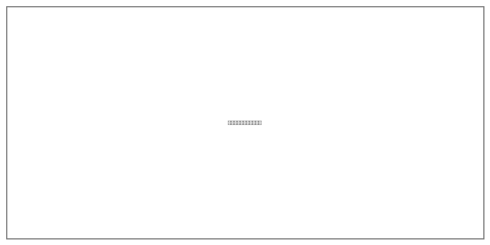
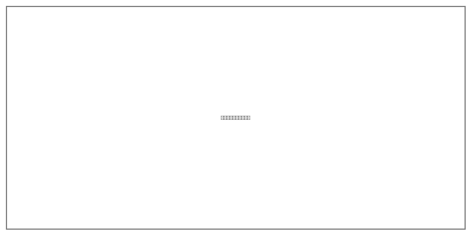

# 全院环境清洁消毒服务方案

## 整体组织架构策划

### 组织架构设置

针对广汉市人民医院后勤综合服务项目，我公司建立"三级管理、分区负责"的清洁消毒服务组织架构。项目占地170亩，建筑面积145003.09㎡，编制床位800张，涵盖门急诊医技楼、住院楼、感染楼、后勤楼、科教楼等多个建筑单体。

**第一层级：项目经理（1人）**
统筹管理全院清洁消毒工作，对接医院后勤管理部门，制定年度计划，组织质量考核。

**第二层级：区域主管（3人）**
设置门急诊、住院、特殊区域主管各1名，负责分管区域的日常管理、人员调度、质量监督。

**第三层级：班组长及一线保洁员**
根据各区域工作量配置班组长和保洁人员，设置病区组长、公共区域组长、专项清洁组长。

### 岗位职责划分

| 岗位名称 | 人数 | 主要职责 | 任职要求 |
|---------|------|---------|---------|
| 项目经理 | 1人 | 统筹管理、对接医院 | 大专以上学历，5年以上经验 |
| 区域主管 | 3人 | 区域管理、质量监督 | 高中以上学历，3年以上经验 |
| 病区组长 | 若干 | 病区日常清洁消毒 | 初中以上学历，2年以上经验 |
| 专项清洁组长 | 若干 | 手术室、ICU等特殊区域 | 持有院感培训合格证 |
| 一线保洁员 | 若干 | 执行清洁消毒任务 | 身体健康，持有健康证 |

### 服务范围覆盖

| 区域类别 | 涉及建筑 | 建筑面积 | 服务内容 |
|---------|---------|---------|---------|
| 门急诊区域 | 门急诊医技楼 | 64305.08㎡ | 日常保洁、地面养护 |
| 住院区域 | 住院楼 | 64127㎡ | 病房清洁、走廊消毒 |
| 特殊区域 | 感染楼 | 4342.18㎡ | 严格消毒、隔离清洁 |
| 后勤区域 | 后勤楼 | 4508.51㎡ | 日常保洁、设备清洁 |
| 其他区域 | 科教楼等 | 6912.38㎡ | 日常保洁、专项清洁 |

建立"日检查、周例会、月考核"管理机制，实现全流程数字化管理。

## 设备物品配置

### 清洁设备配置方案

根据医院清洁消毒服务需求，配置专业清洁设备，遵循"够用、实用、耐用"原则。

**大型清洁设备配置清单**

| 序号 | 设备名称 | 数量 | 功能用途 | 配置区域 |
|------|---------|------|---------|---------|
| 1 | 驾驶式洗地机 | 6台 | 大面积地面清洗 | 门诊大厅、住院楼 |
| 2 | 手推式洗地机 | 3台 | 中小面积地面清洗 | 各病区、诊室 |
| 3 | 加重型擦地机 | 2台 | 地面深度清洁 | 全院地面养护 |
| 4 | 扫地机 | 1台 | 室外地面清扫 | 院区道路、广场 |
| 5 | 吸水吸尘机 | 1台 | 地面干燥处理 | 各区域应急使用 |
| 6 | 高压清洗机 | 2台 | 地面冲洗清洗 | 院区道路、外墙 |
| 7 | 电动喷雾机 | 2台 | 消毒消杀 | 全院消毒消杀 |

**辅助清洁工具配置**

| 类别 | 物品名称 | 配置标准 | 更换周期 |
|------|---------|---------|---------|
| 地面清洁 | 拖把、榨水车 | 每病区1套 | 每月更换 |
| 玻璃清洁 | 玻璃刮、伸缩杆 | 每层楼1套 | 每季度更换 |
| 卫生间清洁 | 马桶刷、洁厕剂 | 每卫生间1套 | 每周更换 |
| 垃圾收集 | 分类垃圾桶、垃圾袋 | 按标准配置 | 每日更换 |

### 消毒物品配置方案

消毒物品配置严格遵循《医疗机构消毒技术规范》（WS/T 367-2012）要求。

**消毒药剂配置标准**

| 消毒类别 | 消毒剂名称 | 有效浓度 | 适用区域 |
|---------|-----------|---------|---------|
| 高水平消毒 | 含氯消毒剂 | 1000mg/L | 感染科、发热门诊 |
| 中水平消毒 | 过氧化氢消毒剂 | 3% | 手术室、ICU |
| 低水平消毒 | 季铵盐类消毒剂 | 按说明 | 普通病房、门诊 |
| 手卫生 | 速干手消毒剂 | 75%酒精 | 全院各区域 |

**特殊科室消毒用品配置**

| 科室名称 | 特殊消毒要求 | 专用消毒物品 |
|---------|-------------|-------------|
| 手术室 | 高水平消毒，术前术后各消毒1次 | 含碘消毒液、专用擦拭巾 |
| ICU | 每日多次消毒 | 含氯消毒片、消毒湿巾 |
| 感染科 | 严格隔离消毒 | 高浓度含氯消毒剂 |

### 耗材供应计划

建立"三级库存"耗材供应保障体系：

- **一级库存：院内周转仓**，库存量满足7天使用需求
- **二级库存：区域分仓**，库存量满足3天使用需求
- **三级库存：公司储备仓**，库存量满足30天使用需求

| 物资类别 | 采购周期 | 安全库存 | 供应商数量 |
|---------|---------|---------|-----------|
| 消毒药剂 | 每月采购 | 15天用量 | 2家以上 |
| 清洁工具 | 每季度采购 | 30天用量 | 2家以上 |
| 防护用品 | 每月采购 | 15天用量 | 2家以上 |

## 病区清洁消毒标准流程

### 病区清洁消毒标准

病区清洁消毒工作严格执行《医疗机构消毒技术规范》（WS/T 367-2012）和《医院消毒卫生标准》（GB 15982-2012）要求。

**病区清洁消毒等级划分**

| 区域等级 | 适用科室 | 清洁消毒频次 | 消毒液浓度 |
|---------|---------|-------------|-----------|
| Ⅰ类环境 | 手术室、产房、新生儿室 | 每日3次 | 含氯消毒剂500mg/L |
| Ⅱ类环境 | ICU、供应室、透析室 | 每日3次 | 含氯消毒剂500mg/L |
| Ⅲ类环境 | 普通病房、诊室 | 每日2次 | 含氯消毒剂250mg/L |
| Ⅳ类环境 | 卫生间、走廊 | 每日2次 | 含氯消毒剂250mg/L |

### 病区清洁消毒标准流程

**病区清洁消毒标准操作规程**

**第一步：准备阶段**
穿戴防护装备，检查清洁工具，配置消毒液并检测浓度。

**第二步：清洁阶段**
湿式清扫地面，擦拭物表消毒，清洁卫生间，更换垃圾袋。

**第三步：消毒阶段**
物表消毒（作用30分钟），空气消毒（不少于30分钟），终末消毒。

**第四步：检查阶段**
目视检查，荧光检测（合格率≥90%），ATP检测（≤100RLU）。

**第五步：记录阶段**
填写《病区清洁消毒记录表》，签字确认。

### 病区清洁消毒频次安排

| 时间段 | 工作内容 | 涉及区域 | 质量标准 |
|-------|---------|---------|---------|
| 06:00-07:30 | 晨间清洁 | 所有病区 | 地面干燥、物表光洁 |
| 08:00-09:00 | 重点消毒 | 治疗室、处置室 | 物表消毒合格 |
| 11:00-12:00 | 午间保洁 | 卫生间、走廊 | 地面无积水 |
| 14:00-15:00 | 下午消毒 | 所有病区 | 物表擦拭消毒 |
| 17:00-18:00 | 晚间保洁 | 公共区域 | 全面保洁、垃圾清运 |
| 随脏随洁 | 应急处理 | 污染区域 | 立即消毒处理 |

### 特殊病区清洁消毒规范

**感染性疾病科**：使用专用工具，消毒液浓度1000mg/L，作用时间60分钟，穿戴全套防护装备。

**新生儿室**：使用低刺激性消毒剂，避开喂奶和探视时间，进入前更换专用工作服。

**重症医学科（ICU）**：物表每日消毒3次，地面每日消毒3次，设备表面每日消毒2次，空气消毒每日2次。

## 公共区域维护消毒

### 公共区域划分与标准

广汉市人民医院公共区域包括门诊大厅、走廊通道、卫生间、电梯轿厢、楼梯间、候诊区等。根据《医院消毒卫生标准》（GB 15982-2012）要求，制定公共区域维护消毒标准。

**公共区域清洁消毒等级标准**

| 区域名称 | 清洁等级 | 清洁频次 | 消毒频次 | 质量标准 |
|---------|---------|---------|---------|---------|
| 门诊大厅 | Ⅰ级 | 每日4次 | 每日2次 | 地面光洁、无垃圾 |
| 走廊通道 | Ⅰ级 | 每日4次 | 每日2次 | 地面干燥、扶手光洁 |
| 卫生间 | Ⅰ级 | 每2小时1次 | 每日3次 | 无异味、无积水 |
| 电梯轿厢 | Ⅰ级 | 每日4次 | 每日3次 | 按键消毒、无异味 |
| 楼梯间 | Ⅱ级 | 每日2次 | 每日1次 | 地面清洁、无杂物 |

### 公共区域维护消毒标准流程

**门诊大厅维护消毒流程**

保洁作业：开业前全面清扫，早间巡查清扫，上午每30分钟巡查，午间全面清扫，下午每30分钟巡查，晚间全面清扫消毒。

消毒作业：物表消毒（含氯消毒剂250mg/L擦拭），地面消毒（消毒液拖地，作用30分钟），空气消毒（营业结束后消毒1小时）。

**走廊通道维护消毒流程**

保洁作业：湿式清扫地面，擦拭墙面、踢脚线，擦拭扶手，清理垃圾桶。

消毒作业：扶手每日2次消毒，地面每日2次消毒，消防设施每月1次擦拭。

**卫生间维护消毒流程**

保洁作业（每2小时1次）：清理垃圾，清洁洁具，擦拭镜面，补充用品，地面清洁。

消毒作业（每日3次）：马桶消毒（含氯消毒剂500mg/L），物表消毒，地面消毒，空气消毒。

**电梯轿厢维护消毒流程**

保洁作业（每日4次）：清扫地面，擦拭墙面，清理门轨。

消毒作业（每日3次）：按键消毒（75%酒精），扶手消毒，墙面消毒。

### 公共区域特殊时段保洁

**就诊高峰时段**：增加保洁人员，门诊大厅配备2名专职保洁员，每30分钟巡查清扫。

**雨雪天气**：入口处铺设防滑地垫，增加地面拖擦频次，设置"小心地滑"警示标识。

### 公共区域质量检查标准

| 检查项目 | 检查标准 | 检查方法 | 检查频次 |
|---------|---------|---------|---------|
| 地面清洁度 | 无垃圾、无污渍 | 目视检查 | 每日4次 |
| 物表光洁度 | 无灰尘、光洁明亮 | 白手套擦拭 | 每日2次 |
| 卫生间无异味 | 无明显异味 | 嗅觉检查 | 每2小时1次 |
| 消毒记录 | 记录完整、真实 | 查阅记录 | 每日1次 |

建立公共区域清洁质量巡检制度，区域主管每日巡检不少于3次，项目经理每周巡检不少于2次，发现问题立即整改。
