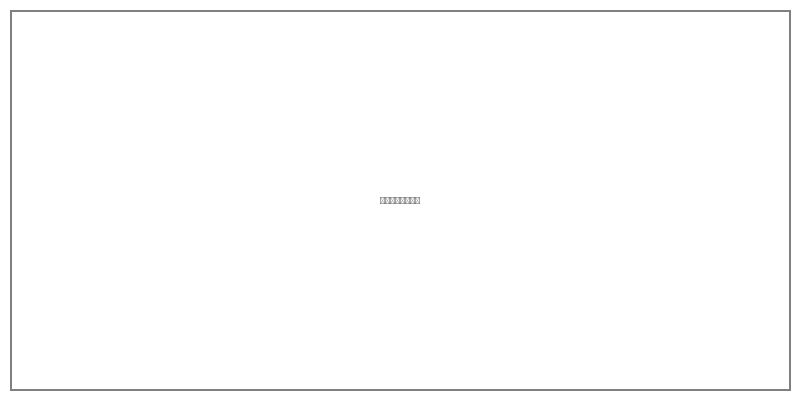

## 设备物品配置

### 清洁设备配置方案

根据广汉市人民医院清洁消毒服务需求，我公司配置专业清洁设备，确保各类区域的清洁消毒工作高效开展。设备配置遵循"够用、实用、耐用"原则，兼顾日常清洁和深度清洁需求。

**大型清洁设备配置清单**

| 序号 | 设备名称 | 数量 | 品牌型号 | 功能用途 | 配置区域 |
|------|---------|------|---------|---------|---------|
| 1 | 驾驶式洗地机 | 6台 | R660B/H120 | 大面积地面清洗 | 门诊大厅、住院楼走廊 |
| 2 | 手推式洗地机 | 3台 | I20NB | 中小面积地面清洗 | 各病区、诊室区域 |
| 3 | 加重型擦地机 | 2台 | IP180/80升 | 地面深度清洁养护 | 全院地面养护 |
| 4 | 扫地机 | 1台 | E800 | 室外地面清扫 | 院区道路、广场 |
| 5 | 吸水吸尘机 | 1台 | 工业级 | 地面干燥处理 | 各区域应急使用 |
| 6 | 驾驶式高压清洗机 | 1台 | - | 地面冲洗清洗 | 院区道路、停车场 |
| 7 | 高压清洗一体机 | 1台 | - | 地面冲洗清洗 | 外墙清洗、地面深度清洁 |
| 8 | 电动喷雾机 | 2台 | - | 消毒消杀、绿化喷药 | 全院消毒消杀 |

**辅助清洁工具配置**

| 类别 | 物品名称 | 配置标准 | 更换周期 |
|------|---------|---------|---------|
| 地面清洁 | 拖把、榨水车 | 每病区1套 | 每月更换 |
| 玻璃清洁 | 玻璃刮、伸缩杆 | 每层楼1套 | 每季度更换 |
| 卫生间清洁 | 马桶刷、洁厕剂 | 每卫生间1套 | 每周更换 |
| 垃圾收集 | 分类垃圾桶、垃圾袋 | 按标准配置 | 垃圾袋每日更换 |
| 工具收纳 | 保洁工具车 | 每病区1辆 | 每年更换 |

### 消毒物品配置方案

消毒物品配置严格遵循《医疗机构消毒技术规范》（WS/T 367-2012）和《医院消毒卫生标准》（GB 15982-2012）要求，根据不同区域的消毒等级配置相应的消毒药剂。

**消毒药剂配置标准**

| 消毒类别 | 消毒剂名称 | 有效浓度 | 适用区域 | 配置比例 |
|---------|-----------|---------|---------|---------|
| 高水平消毒 | 含氯消毒剂（泡腾片） | 1000mg/L | 感染科、发热门诊、隔离病房 | 35% |
| 中水平消毒 | 过氧化氢消毒剂 | 3% | 手术室、ICU、新生儿室 | 25% |
| 低水平消毒 | 季铵盐类消毒剂 | 按说明 | 普通病房、门诊区域 | 20% |
| 手卫生 | 速干手消毒剂 | 75%酒精 | 全院各区域 | 15% |
| 空气消毒 | 紫外线灯管/空气消毒机 | - | 各科室 | 5% |

**特殊科室消毒用品配置**

| 科室名称 | 特殊消毒要求 | 专用消毒物品 |
|---------|-------------|-------------|
| 手术室 | 高水平消毒，术前术后各消毒1次 | 含碘消毒液、过氧化氢、手术室专用擦拭巾 |
| ICU | 每日多次消毒，物表每日3次擦拭 | 含氯消毒片、一次性消毒湿巾 |
| 内镜中心 | 内镜专用消毒液，严格浸泡时间 | 戊二醛、邻苯二甲醛、内镜专用消毒机 |
| 感染科 | 严格隔离消毒，按传染病规范处理 | 高浓度含氯消毒剂、个人防护装备 |
| 新生儿室 | 温和消毒，避免刺激 | 低刺激性消毒剂、婴儿专用清洁剂 |

### 耗材供应计划

建立"三级库存"耗材供应保障体系，确保清洁消毒物资不断档：

**一级库存：院内周转仓**
在医院后勤区域设置周转仓库，存放常用清洁工具和消毒药剂，库存量满足7天使用需求。由项目物资管理员负责管理，每日盘点，及时补充。

**二级库存：区域分仓**
在各区域设置小型分仓，存放日常消耗品，库存量满足3天使用需求。由各区域组长负责管理，每周盘点，向周转仓申领补充。

**三级库存：公司储备仓**
我公司在广汉市设立物资储备仓库，存放应急物资和大宗耗材，库存量满足30天使用需求。由公司采购部门统一管理，根据院内消耗情况定期配送。

**耗材采购与供应保障**

| 物资类别 | 采购周期 | 安全库存 | 供应商数量 | 应急储备 |
|---------|---------|---------|-----------|---------|
| 消毒药剂 | 每月采购 | 15天用量 | 2家以上 | 7天用量 |
| 清洁工具 | 每季度采购 | 30天用量 | 2家以上 | 15天用量 |
| 垃圾袋 | 每月采购 | 15天用量 | 2家以上 | 7天用量 |
| 防护用品 | 每月采购 | 15天用量 | 2家以上 | 7天用量 |
| 纸品耗材 | 每月采购 | 15天用量 | 2家以上 | 7天用量 |

建立供应商评价机制，每季度对供应商进行考核，确保物资质量和供应稳定性。签订应急供货协议，在突发情况下可快速调配物资。
