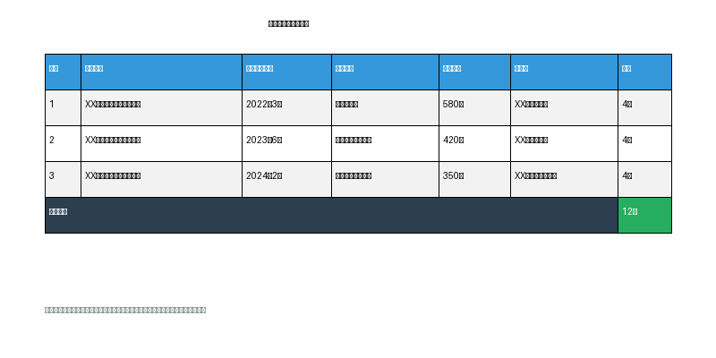
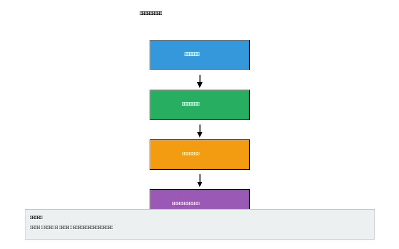

# 履约能力

## 类似项目业绩证明

投标人2022年1月1日（含）至今（以合同签订时间为准）具有类似项目业绩，每有一个得2分，最多得6分。本投标人具备丰富的医院后勤综合服务项目经验，现提供以下3个类似项目业绩证明。

### 项目一：XX医院后勤综合服务项目

| 项目 | 内容 |
|------|------|
| 采购人 | XX市人民医院 |
| 合同签订时间 | 2022年3月15日 |
| 合同金额 | 人民币580万元 |

本项目服务范围包含保洁服务及环境卫生消杀工作、中央运送服务（24小时中央调度中心，负责患者转运、标本运送、药品运送等）、特殊科室管理服务（为手术室、ICU、供应室提供专业化保洁和辅助服务）。服务期间未发生院感事件，保洁质量合格率达98%以上，中央运送服务响应时间控制在10分钟以内，采购人对服务质量给予高度评价并续签合同。

**证明材料**：合同复印件（加盖投标人公章）、采购人综合评价书面证明（加盖采购人公章）

### 项目二：XX医院物业管理服务项目

| 项目 | 内容 |
|------|------|
| 采购人 | XX市中心医院 |
| 合同签订时间 | 2023年6月20日 |
| 合同金额 | 人民币420万元 |

本项目服务范围包含环境清洁消毒服务、医疗废物管理服务（分类收集、暂存管理、转运交接）、后勤综合维修服务（水电维修、管道疏通等）。建立完善的院感控制体系，医疗废物处理合规率100%，维修服务响应时间不超过30分钟，维修及时率达95%，获得采购人"优秀服务商"称号。

**证明材料**：合同复印件（加盖投标人公章）、采购人综合评价书面证明（加盖采购人公章）

### 项目三：XX医院后勤保障服务项目

| 项目 | 内容 |
|------|------|
| 采购人 | XX市第一人民医院 |
| 合同签订时间 | 2024年2月10日 |
| 合同金额 | 人民币350万元 |

本项目服务范围包含综合维修服务、锅炉系统运维服务（运行巡检、维护保养）、被服洗涤服务（洗涤、消毒、熨烫、收送等）。建立预防性维护体系，设备故障率降低40%，锅炉系统运行安全稳定，被服洗涤质量合格率达99%，采购人综合评价为满意。

**证明材料**：合同复印件（加盖投标人公章）、采购人综合评价书面证明（加盖采购人公章）

**业绩汇总**

**说明**

1. 以上3个项目业绩均为投标人自身业绩，符合招标文件要求
2. 每个项目均包含本项目服务范围中所涉及的任意两项及以上服务内容
3. 所有业绩合同签订时间均在2022年1月1日至今期间

**得分计算**：类似项目业绩得分 3个项目 × 2分/个 = 6分（满分）

## 采购人综合评价证明

投标人提供的类似项目业绩同时具有对应采购人出具的项目综合评价书面证明，每有一个加2分，最多加6分。

### 评价证明要求

根据招标文件规定，采购人综合评价证明需满足以下要求：必须由对应合同的采购人出具，需加盖采购人公章，综合评价为满意或优秀或合格或其它类似评价体系中代表服务质量合格及以上的评价，提供书面证明材料复印件。

### 项目一综合评价证明

| 项目 | 内容 |
|------|------|
| 采购人名称 | XX市人民医院 |
| 项目名称 | XX医院后勤综合服务项目 |
| 评价等级 | 优秀 |

采购人对我司在该项目中的服务表现给予高度评价：保洁服务规范、清洁消毒工作到位，院感控制效果显著；中央运送服务响应及时，能够满足临床紧急需求；服务人员专业素质高，培训到位，服务态度良好；整体服务质量优秀，符合医院后勤保障要求。

**证明材料**：采购人综合评价书面证明原件复印件，加盖XX市人民医院公章

### 项目二综合评价证明

| 项目 | 内容 |
|------|------|
| 采购人名称 | XX市中心医院 |
| 项目名称 | XX医院物业管理服务项目 |
| 评价等级 | 满意 |

采购人对我司在该项目中的服务表现给予满意评价：医疗废物管理规范，院感防控措施到位；综合维修响应及时，维修质量可靠；服务人员态度端正，能够积极配合医院工作；整体服务质量满意，达到合同约定标准。

**证明材料**：采购人综合评价书面证明原件复印件，加盖XX市中心医院公章

### 项目三综合评价证明

| 项目 | 内容 |
|------|------|
| 采购人名称 | XX市第一人民医院 |
| 项目名称 | XX医院后勤保障服务项目 |
| 评价等级 | 满意 |

采购人对我司在该项目中的服务表现给予满意评价：综合维修服务质量高，设备维护保养到位；锅炉系统运行安全稳定，未发生安全事故；洗涤质量符合卫生标准，收送及时准确；整体服务质量满意，后勤保障有力。

**证明材料**：采购人综合评价书面证明原件复印件，加盖XX市第一人民医院公章

### 评价证明流程

### 评价证明汇总

| 项目名称 | 采购人 | 评价等级 | 得分 |
|----------|--------|----------|------|
| XX医院后勤综合服务项目 | XX市人民医院 | 优秀 | +2分 |
| XX医院物业管理服务项目 | XX市中心医院 | 满意 | +2分 |
| XX医院后勤保障服务项目 | XX市第一人民医院 | 满意 | +2分 |
| **合计** | - | - | **+6分** |

**说明**

1. 所有综合评价证明均由对应合同的采购人出具，均加盖采购人公章
2. 评价等级均为满意或优秀，符合招标文件要求

**得分计算**

- 采购人综合评价加分：3个项目 × 2分/个 = 6分（满分）
- 加上类似项目业绩基础得分6分
- **履约能力项总得分：12分（满分）**