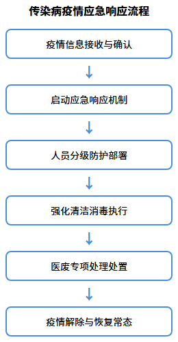

## 传染病疫情应急

针对传染病疫情等突发公共卫生事件，制定专项应急措施。

### 疫情响应流程

30分钟内启动响应，对接院感科明确防控要求。分三级响应：一级常规强化消毒，二级增加频次和防护，三级封闭区域消杀和闭环管理。

### 防护与消毒措施

配备N95口罩、防护服、护目镜等装备。疫情期消毒频次提至每日4次，重点区域每2小时消毒，含氯消毒液浓度提至1000mg/L。医废双层密封、专车转运。

