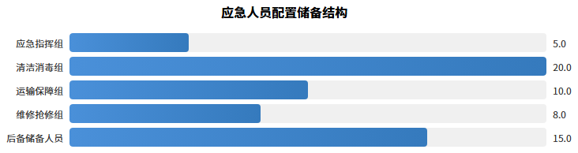

## 应急人员配置储备

我公司建立应急人员配置与储备机制，确保突发事件快速响应。

### 应急人员配置

成立应急指挥小组，项目经理任组长，下设清洁消毒组（20人）、运输保障组（10人）、维修抢修组（8人）及指挥人员5人，合计43人。

### 人员储备机制

三级储备体系：一级在岗队员随时待命；二级后备人员15人，2小时内到岗；三级与劳务公司签订用工协议补充人力。每季度演练，每年培训两次。

