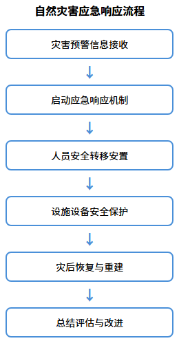
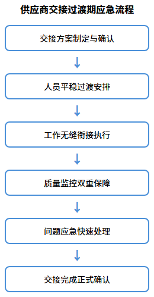

# 应急预案

## 应急人员配置储备

我公司建立应急人员配置与储备机制，确保突发事件快速响应。

### 应急人员配置

成立应急指挥小组，项目经理任组长，下设清洁消毒组（20人）、运输保障组（10人）、维修抢修组（8人）及指挥人员5人，合计43人。

### 人员储备机制

三级储备体系：一级在岗队员随时待命；二级后备人员15人，2小时内到岗；三级与劳务公司签订用工协议补充人力。每季度演练，每年培训两次。

## 传染病疫情应急

针对传染病疫情等突发公共卫生事件，制定专项应急措施。

### 疫情响应流程

30分钟内启动响应，对接院感科明确防控要求。分三级响应：一级常规强化消毒，二级增加频次和防护，三级封闭区域消杀和闭环管理。

### 防护与消毒措施

配备N95口罩、防护服、护目镜等装备。疫情期消毒频次提至每日4次，重点区域每2小时消毒，含氯消毒液浓度提至1000mg/L。医废双层密封、专车转运。

## 停电停水爆管应急

针对停电、停水、管道爆裂等突发故障，制定专项应急方案。

### 停电应急措施

维修组10分钟到场，协助启用备用电源，优先保障手术室、ICU、急诊科供电。增派保洁巡查走廊楼梯，恢复后检查设备状态。

### 停水爆管应急措施

停水后调配桶装水保障临床用水。爆管时5分钟到场关闭阀门、清理积水并抢修。完成后对受影响区域全面消毒。

## 自然灾害应急

针对地震、洪水等自然灾害，制定应急预案保障安全。

### 地震应急措施

组织人员就近避险，震后清点人员配合疏散患者。排查建筑、水电、医气隐患，清理障碍物恢复通道，余震加强巡查。

### 洪水应急措施

预警时储备防汛物资，低洼区域防水封堵。洪水时协助转移设备至高处。退水后清淤排污、环境消杀，防止疫病传播。

## 交接过渡期应急

针对供应商更换期间服务断档风险，制定过渡期应急方案。

### 交接方案制定

合同签订后成立交接工作组，三方对接。交接周期不少于30天，分准备（10天）、并行（15天）、独立（5天）三阶段，明确人员、流程、设备等事项。

### 服务保障措施

双岗并行确保服务不中断，增派20%备用人员。项目经理驻场每日汇报。设立投诉热线2小时响应，双方共监服务质量。

