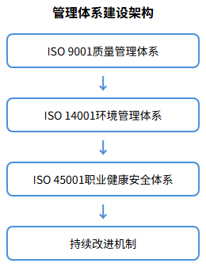
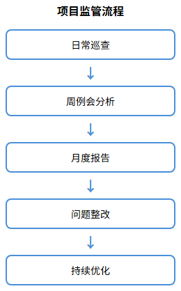
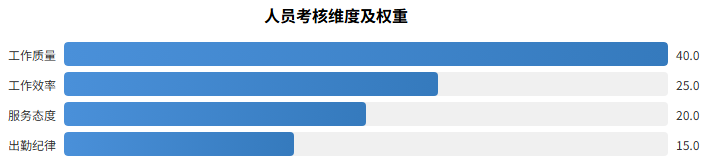
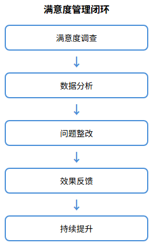

# 管理体系和质量控制体系

## 管理体系建设

我公司针对广汉市人民医院后勤综合服务项目，建立科学完善的管理体系。

### 质量管理体系

依据ISO 9001标准，建立覆盖清洁消毒、中央运输、维修维护全业务链的质量管理制度。制定《服务质量标准手册》和《作业指导书》，明确操作规程和验收标准。设立质量管理部，配备专职质量督导员，定期开展质量审核。

### 环境与安全体系

参照ISO 14001标准建立绿色运营管理制度，规范医废分类转运，选用环保清洁药剂。依据ISO 45001标准建立职业健康安全体系，为员工配备防护装备，定期组织职业健康体检。

## 监管措施

建立多层次监管机制，确保项目规范运行。

### 项目监管制度

实行项目经理负责制，设三级监管架构：项目总监统筹、区域主管分区管理、班组长现场执行。项目总监每日不少于2次现场巡查，每周召开例会，每月向医院提交服务报告。

### 人员监管制度

采用智能化考勤系统实现人员全程可追溯。建立岗位责任清单，实施首问责任制和限时办结制。设立投诉举报渠道，接受医院和患者监督。

### 质量检查机制

建立日检、周检、月检三级检查制度。日检由班组长负责，周检由区域主管组织，月检由项目总监主持。检查结果纳入绩效考核，发现问题限期整改。

## 人员考核措施

建立科学的绩效考核体系，激励员工提升服务水平。

### 绩效考核标准

实行百分制考核，从工作质量（40分）、工作效率（25分）、服务态度（20分）、出勤纪律（15分）四维度评价。工作质量包括清洁消毒达标率、设备完好率等指标。

### 奖惩机制

设立月度优秀员工奖、季度服务之星奖、年度先进个人奖。考核优秀者优先晋升加薪，不合格者谈话提醒，连续两次不合格者调岗或辞退。建立红黄牌警示制度，严肃处理违规行为。

### 考核结果应用

考核结果与薪酬挂钩，绩效工资占总薪酬30%。建立员工成长档案，作为岗位调整和职业发展的重要依据。

## 满意度控制指标

建立满意度调查和改进机制，持续提升服务品质。

### 满意度调查方案

每月向各科室发放满意度问卷，每季度组织患者满意度抽样调查，每半年邀请第三方独立评估。百分制计分，85分为达标线，90分以上为优秀。

### 关键控制指标

核心指标：科室综合满意度≥90%，服务响应及时率≥95%，投诉处理满意率≥95%，清洁消毒合格率≥98%。建立预警机制，低于达标线及时预警并启动整改。

### 持续改进措施

建立调查、分析、整改、反馈闭环管理机制。对调查结果专项分析，查找短板制定改进方案。设立24小时服务热线，每季度召开满意度分析会，确保服务质量持续提升。

