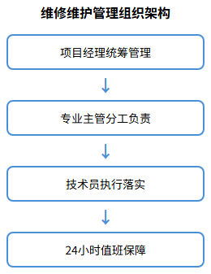
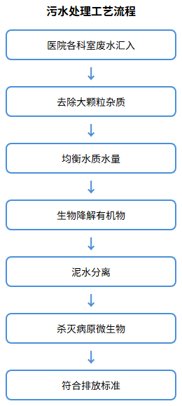

# 维修维护服务方案

## 维修维护管理组织架构

### 方案目标

建立科学、高效的维修维护管理组织架构，确保广汉市人民医院后勤综合服务中的维修维护工作有序开展。通过明确的层级管理和岗位职责划分，实现维修维护服务的标准化、专业化管理，保障医院各类设施设备的正常运行，为医院提供安全、可靠的后勤保障服务。

### 组织架构设置

本项目维修维护管理组织架构采用"项目经理—技术主管—专业班组"三级管理模式，确保指令传达高效、责任落实到位。

**第一层级：项目经理**
全面负责维修维护服务的统筹管理，对接医院后勤管理部门，协调各专业班组工作，处理重大维修事项和应急事件。

**第二层级：技术主管**
负责技术指导和质量监督，制定维修维护计划和技术标准，组织技术培训和安全教育，审核维修方案和验收维修质量。

**第三层级：专业班组**
根据服务内容设置四个专业班组：

| 班组名称 | 人员配置 | 主要职责 |
|---------|---------|---------|
| 综合维修组 | 6人 | 水电木工维修、管道疏通、设施维护 |
| 锅炉运维组 | 1人 | 热水锅炉系统运行维护 |
| 医气运维组 | 1人 | 制氧站医气系统及钢瓶管理 |
| 污水处理组 | 3人 | 污水处理站运行维护 |

### 岗位设置与职责

**项目经理岗位职责**
- 制定维修维护服务整体方案和工作计划
- 组织协调各班组工作，监督服务质量
- 对接医院后勤管理部门，处理投诉和建议
- 负责人员培训、考核和安全管理

**技术主管岗位职责**
- 制定维修维护技术标准和操作规程
- 指导各班组技术工作，解决技术难题
- 组织设备巡检和安全隐患排查
- 审核维修方案，验收维修质量

**综合维修组岗位职责**
- 负责医院水电木工日常维修维护
- 处理给排水系统故障和管道疏通
- 维修更换各类阀门、水表、卫生洁具
- 完成门窗、办公家具等设施维修

**锅炉运维组岗位职责**
- 负责热水锅炉系统日常运行巡检
- 记录锅炉运行数据，发现隐患及时处理
- 配合专业检测机构进行安全检测
- 做好锅炉房安全管理

**医气运维组岗位职责**
- 负责制氧站医气系统日常运行巡查
- 监测供气压力和设备运行状态
- 协助医气钢瓶装卸入库和运送回收
- 处理供气管路和终端一般性维修

**污水处理组岗位职责**
- 负责污水处理设备运行和巡查
- 按要求进行污水消毒加药处理
- 进行水质自检和排放监测
- 填写运行记录，配合环保检查

### 值班安排

实行24小时值班制度，确保医院维修维护服务全天候响应：

| 时段 | 值班人员 | 响应要求 |
|------|---------|---------|
| 白班（8:00-18:00） | 各班组全员在岗 | 急修10分钟内到达，其它20分钟内到达 |
| 夜班（18:00-8:00） | 综合维修1人、锅炉/医气各1人 | 急修10分钟内到达现场 |
| 节假日 | 安排轮值人员 | 保持基本服务保障能力 |

值班人员须严格遵守交接班制度，做好值班记录，确保维修维护服务连续性和信息传递准确性。

---

## 综合维修服务方案

### 方案目标

建立规范、高效的综合维修服务体系，为广汉市人民医院提供及时、专业的水电木工维修服务。通过标准化的报修流程、严格的响应时间要求和明确的质量标准，确保医院各类设施设备的正常运行，满足医院日常运营和医疗服务需求。

### 日常报修流程

建立"报修—派单—维修—验收—归档"五步闭环报修流程，确保每项维修任务可追溯、可考核。

**报修受理**
医院各科室通过维修报修软件或电话报修，服务中心统一受理，记录报修时间、地点、故障描述等信息。紧急报修（如水管爆裂、电气故障等）立即响应，一般报修按流程派单。

**任务派发**
根据故障类型和地点，指派相应专业维修人员。维修人员接单后，携带工具和常用材料前往现场。如需特殊材料，及时与仓库沟通调配。

**现场维修**
维修人员到达现场后，先进行故障诊断，制定维修方案，经报修科室确认后实施维修。维修过程中注意保护现场环境，遵守医院院感控制要求。

**质量验收**
维修完成后，由报修科室进行验收，确认维修质量合格后签字确认。如验收不合格，维修人员须立即整改，直至达到验收标准。

**记录归档**
维修人员填写维修记录单，详细记录故障原因、维修内容、使用材料等信息。服务中心定期汇总分析维修数据，为设备维护保养提供依据。

### 维修响应时间

严格按照招标文件要求的响应时间标准执行：

| 维修类型 | 响应时间 | 到达现场时间 | 完成时间 |
|---------|---------|-------------|---------|
| 紧急维修（水管爆裂、电气故障等） | 立即响应 | 10分钟内 | 视故障复杂程度 |
| 一般维修 | 5分钟内派单 | 20分钟内 | 当日完成 |
| 计划性维修 | 提前预约 | 按约定时间 | 按计划完成 |

**紧急维修定义**
- 水管爆裂、严重漏水
- 电气故障、线路短路
- 电梯困人
- 其他影响医院正常运营的突发故障

**一般维修定义**
- 水龙头、阀门更换
- 灯具、开关维修
- 门窗、家具维修
- 其他非紧急维修事项

### 维修质量标准

**维修作业标准**
- 维修前做好现场保护，避免二次损坏
- 维修过程规范操作，遵守安全规程
- 维修材料符合质量要求，优先使用原厂配件
- 维修完成后清理现场，恢复原状

**验收质量标准**
- 水电维修：无渗漏、无短路，功能恢复正常
- 管道维修：连接牢固，无渗漏，排水通畅
- 门窗维修：开关灵活，密封良好，五金件完好
- 家具维修：结构牢固，表面平整，功能正常

**维修服务承诺**
- 维修及时率≥95%
- 维修一次合格率≥90%
- 客户满意度≥90%
- 维修返修率≤5%

### 维修服务内容

根据招标文件要求，综合维修服务内容包括：

**给排水系统维修**
- 冷热水龙头、水表、卫生洁具维修更换
- 水箱及配件维修更换
- 感应水龙头水阀、脚踏阀、截止阀维修更换
- 墙体内、地下管道、阀门维修更换
- 地面、屋面雨水、污水管道疏通

**电气系统维修**
- 灯具、开关、插座维修更换
- 配电箱、线路故障排查维修
- 电动工具、气动工具维修

**木工维修**
- 门窗、办公桌椅维修
- 木制家具维修更换
- 门锁、锁芯更换
- 吊柜、壁柜安装维修

**金属设施维修**
- 病床、陪伴椅、治疗车维修
- 金属管道焊接维修
- 板车维修及泵轮调节修理

### 维修工作计划

制定综合维修周、月、年计划，确保维修工作有序开展：

| 计划类型 | 计划内容 | 执行频次 |
|---------|---------|---------|
| 周计划 | 重点设备巡检、常规维修任务安排 | 每周制定 |
| 月计划 | 设备维护保养、维修数据分析 | 每月制定 |
| 年计划 | 设备大修、更新改造计划 | 每年制定 |

通过计划性维修，变被动维修为主动维护，提高设备运行可靠性，降低故障发生率。

---

## 热水锅炉系统运维

### 方案目标

建立规范、安全的热水锅炉系统运行维护管理体系，确保广汉市人民医院热水锅炉系统（常压）安全、稳定、高效运行。通过严格的日常巡检、科学的维护保养和完善的安全检查制度，保障医院24小时热水供应需求，同时确保锅炉运行安全，延长设备使用寿命。

### 锅炉运行管理

**运行巡检制度**

建立白班、夜班双重巡检机制，确保锅炉系统全天候监控：

| 巡检时段 | 巡检频次 | 巡检内容 | 记录要求 |
|---------|---------|---------|---------|
| 白班（8:00-18:00） | 每2小时一次 | 全面巡检，记录运行数据 | 填写巡检记录表 |
| 夜班（18:00-8:00） | 每4小时一次 | 重点巡检，监测异常情况 | 填写巡检记录表 |

**巡检内容清单**

| 检查项目 | 检查标准 | 异常处理 |
|---------|---------|---------|
| 天然气泄漏 | 无泄漏，报警装置正常 | 发现泄漏立即停机，通知燃气公司 |
| 锅炉温度 | 在设置范围内（通常60-80℃） | 调整燃烧机参数 |
| 燃烧机 | 工作正常，火焰稳定 | 检查点火装置，清理积碳 |
| 热水循环泵 | 运转正常，无异响 | 检查轴承、密封，必要时更换 |
| 控制柜 | 运行正常，指示灯正常 | 检查线路、接触器 |
| 安全阀 | 动作可靠，无泄漏 | 定期校验，必要时更换 |
| 温度压力表 | 显示准确，无损坏 | 定期校验，必要时更换 |
| 水处理器 | 工作正常，水质合格 | 检查滤芯，更换再生剂 |

**运行数据记录**

每班次记录以下运行数据：
- 锅炉进/出水温度
- 系统压力
- 燃气消耗量
- 循环泵运行状态
- 水处理设备运行状态
- 异常情况及处理记录

### 维护保养计划

制定科学的维护保养计划，确保锅炉系统长期稳定运行：

**日常保养**
- 清洁锅炉房环境，保持设备整洁
- 检查各连接部位有无渗漏
- 检查仪表、阀门工作状态
- 记录运行数据，分析运行趋势

**月度保养**
- 检查燃烧机工作状态，清理积碳
- 检查循环泵轴承、密封情况
- 检查安全阀、压力表工作状态
- 检查水处理设备，更换滤芯

**季度保养**
- 清洗锅炉换热面，提高换热效率
- 检查电气线路、控制元件
- 校验安全附件、仪表
- 检查管道保温，修补破损处

**年度保养**
- 配合专业检测机构进行锅炉安全检测
- 检测锅炉电机性能、程序控制器
- 检测锅炉排放烟气
- 水泵启动控制柜、锅炉控制柜年度保养
- 系统内管道、阀门全面检查维护

| 保养类型 | 保养周期 | 主要内容 | 责任人 |
|---------|---------|---------|--------|
| 日常保养 | 每日 | 环境清洁、渗漏检查、数据记录 | 锅炉运维员 |
| 月度保养 | 每月 | 燃烧机、循环泵、安全阀检查 | 锅炉运维员 |
| 季度保养 | 每季 | 换热面清洗、电气检查、仪表校验 | 技术主管 |
| 年度保养 | 每年 | 全面检测、控制柜保养、管道维护 | 项目经理+专业机构 |

### 安全检查制度

**安全检查内容**
- 天然气泄漏检测：每日检查燃气管道、阀门，确保无泄漏
- 安全附件检查：安全阀、压力表、温度表定期校验，确保动作可靠
- 电气安全检查：检查电气线路、接地保护，防止漏电、短路
- 消防设施检查：检查灭火器、消防栓，确保完好有效

**安全操作规程**
- 司炉工持证上岗，严格执行操作规程
- 锅炉运行期间，值班人员不得离岗
- 发现异常情况立即停机，报告上级
- 定期进行安全培训和应急演练

**应急预案**
- 制定锅炉故障应急预案，明确应急处置流程
- 配备应急抢修工具和备品备件
- 与燃气公司、设备厂商建立应急联动机制
- 定期组织应急演练，提高应急处置能力

**安全管理措施**
- 锅炉房实行封闭管理，非工作人员禁止入内
- 锅炉房内配备天然气泄漏报警装置
- 锅炉房内配备消防器材，定期检查更换
- 锅炉运行记录保存不少于3年

---

## 医气系统及钢瓶运维

### 方案目标

建立安全、可靠的医用中心制氧站医气系统及医气钢瓶运行维护管理体系，确保广汉市人民医院医用气体供应安全、稳定、连续。通过严格的日常巡检、科学的维护保养和完善的安全监测制度，保障医院临床用氧需求，确保医气系统安全运行，为患者生命安全提供保障。

### 制氧站运行管理

**系统组成**

医用中心制氧站医气系统包括：
- 制氧机组：负责医用氧气生产
- 空气压缩机组：提供压缩空气
- 负压吸引机组：提供负压吸引
- 汇流排：备用气体切换

**巡检制度**

建立白班、夜班双重巡检机制，确保医气系统全天候监控：

| 巡检时段 | 巡检频次 | 巡检方式 | 记录要求 |
|---------|---------|---------|---------|
| 白班（8:00-18:00） | 每3小时一次 | 全面巡检，"看、听、闻" | 填写巡检记录表 |
| 夜班（18:00-8:00） | 2次巡检 | 重点巡检，监测异常 | 填写巡检记录表 |

**巡检内容清单**

| 检查项目 | 检查标准 | 异常处理 |
|---------|---------|---------|
| 制氧机组 | 运行正常，氧气纯度≥90% | 停机检查，通知专业维保 |
| 空压机组 | 运行正常，压力稳定 | 检查气路、电路 |
| 负压机组 | 运行正常，负压值正常 | 检查真空泵、管路 |
| 汇流排 | 切换正常，压力平衡 | 检查切换阀、减压阀 |
| 供气管路 | 无泄漏，压力正常 | 查找泄漏点，及时修复 |
| 医气终端 | 供气正常，无泄漏 | 更换终端或密封件 |

**运行数据记录**

每班次记录以下运行数据：
- 氧气纯度、流量、压力
- 压缩空气压力、温度
- 负压吸引负压值
- 各设备运行状态
- 异常情况及处理记录

### 医气钢瓶管理

**钢瓶入库管理**
- 协助专业维保单位进行医气钢瓶装卸入库
- 检查钢瓶外观、阀门、压力表
- 核对钢瓶数量、规格、有效期
- 按类别分区存放，标识清晰

**钢瓶使用管理**
- 按"先进先出"原则使用钢瓶
- 定期检查钢瓶压力，及时更换
- 记录钢瓶使用情况，建立台账
- 空瓶及时通知氧工运送回收

**钢瓶安全管理**
- 钢瓶存放区域通风良好，远离热源
- 钢瓶直立放置，固定牢固
- 定期检查钢瓶阀门、密封件
- 禁止碰撞、敲击钢瓶

| 管理环节 | 管理要求 | 责任人 |
|---------|---------|--------|
| 入库验收 | 检查外观、压力、有效期 | 医气运维员 |
| 存放管理 | 分类存放、标识清晰、通风良好 | 医气运维员 |
| 使用记录 | 记录使用情况、建立台账 | 医气运维员 |
| 空瓶回收 | 及时通知、规范回收 | 医气运维员 |

### 安全监测

**压力监测**
- 实时监测供气系统压力，确保在正常范围
- 压力异常时立即报警，及时处理
- 定期校验压力表、压力传感器
- 记录压力数据，分析运行趋势

**泄漏监测**
- 每日检查供气管路、阀门、终端
- 使用检漏液或检漏仪检测泄漏
- 发现泄漏立即处理，记录泄漏点
- 定期进行系统气密性试验

**纯度监测**
- 定期检测氧气纯度，确保≥90%
- 记录纯度数据，分析变化趋势
- 纯度异常时立即停机检查
- 配合专业机构进行定期检测

**应急处置**
- 制定医气系统故障应急预案
- 配备应急抢修工具和备品备件
- 与设备厂商建立应急联动机制
- 定期组织应急演练，提高应急处置能力

**安全管理措施**
- 制氧站实行封闭管理，非工作人员禁止入内
- 站内配备氧气浓度报警装置
- 站内配备消防器材，定期检查更换
- 运行记录保存不少于3年

### 维护保养计划

**日常保养**
- 清洁设备表面，保持环境整洁
- 检查各连接部位有无渗漏
- 检查仪表、阀门工作状态
- 记录运行数据，分析运行趋势

**月度保养**
- 检查制氧机组工作状态
- 检查空压机、负压机运行情况
- 检查汇流排切换功能
- 检查供气管路、终端

**季度保养**
- 配合专业维保单位进行月度维护保养
- 校验安全附件、仪表
- 检查电气线路、控制元件
- 清洗、更换过滤器

**年度保养**
- 配合专业维保单位进行年度维护保养
- 全面检测设备性能
- 更换易损件、密封件
- 系统气密性试验

---

## 污水处理站运维

### 方案目标

建立规范、高效的污水处理站维护管理体系，确保广汉市人民医院污水处理站稳定运行，出水水质达到国家排放标准。通过科学的运行管理、严格的水质监测和规范的设备维护，保障医院污水处理达标排放，满足环保部门要求，保护环境安全。

### 污水处理站运行管理

**系统组成**

医院污水处理站包括：
- 格栅除污系统：去除污水中大颗粒杂质
- 调节池：均衡水质水量
- 生化处理系统：降解有机物
- 消毒系统：杀灭病原微生物
- 污泥处理系统：处理剩余污泥

**运行管理制度**

| 管理环节 | 管理要求 | 责任人 |
|---------|---------|--------|
| 白班值守 | 每日8:00-18:00现场值守 | 污水处理员 |
| 24小时应答 | 非值守时段电话应答，30分钟内到场 | 污水处理员 |
| 设备巡检 | 每2小时巡检一次，记录运行数据 | 污水处理员 |
| 加药处理 | 按要求进行消毒加药处理 | 污水处理员 |
| 水质自检 | 按规定进行相关指标自检 | 污水处理员 |
| 记录填写 | 填写运行记录，保存备查 | 污水处理员 |

**运行操作规程**

| 操作环节 | 操作要求 | 注意事项 |
|---------|---------|---------|
| 进水监测 | 监测进水水质、水量 | 发现异常及时报告 |
| 格栅清污 | 每日清理格栅截留物 | 防止堵塞影响处理效果 |
| 生化系统 | 控制溶解氧、污泥浓度 | 保持微生物活性 |
| 消毒加药 | 按比例投加消毒剂 | 确保消毒效果 |
| 出水监测 | 监测出水水质 | 确保达标排放 |
| 污泥处理 | 定期排泥、脱水处理 | 按危废要求处置 |

### 水质监测

**监测指标**

| 监测项目 | 监测频次 | 控制标准 | 监测方法 |
|---------|---------|---------|---------|
| COD | 每日1次 | ≤250mg/L | 重铬酸钾法 |
| BOD5 | 每周1次 | ≤100mg/L | 稀释接种法 |
| SS | 每日1次 | ≤60mg/L | 重量法 |
| 氨氮 | 每日1次 | ≤45mg/L | 纳氏试剂法 |
| 粪大肠菌群 | 每周1次 | ≤5000个/L | 多管发酵法 |
| 总余氯 | 每日2次 | ≥6.5mg/L（接触≥1.5h） | DPD法 |

**监测制度**
- 每日进行常规指标自检，记录监测数据
- 每周进行粪大肠菌群等微生物指标检测
- 每月配合环保部门进行监督性监测
- 每季度委托第三方检测机构进行全面检测

**异常处理**
- 监测数据异常时，立即增加监测频次
- 分析异常原因，调整处理工艺
- 必要时停止排放，进行应急处理
- 及时报告环保部门，配合调查处理

### 设备维护

**日常维护**
- 清洁设备表面，保持环境整洁
- 检查设备运行状态，无异响、无泄漏
- 检查电气线路、控制元件
- 记录设备运行数据

**月度维护**
- 检查格栅除污机，清理杂物
- 检查水泵、风机运行情况
- 检查加药设备，校准加药量
- 检查消毒设备，确保消毒效果

**季度维护**
- 清洗调节池、沉淀池
- 检查曝气系统，清理曝气头
- 检查污泥脱水设备
- 校验监测仪表

**年度维护**
- 全面检修设备，更换易损件
- 清理管道、阀门
- 校验所有监测仪表
- 配合环保部门进行年度检测

| 维护类型 | 维护周期 | 主要内容 | 责任人 |
|---------|---------|---------|--------|
| 日常维护 | 每日 | 设备清洁、状态检查、数据记录 | 污水处理员 |
| 月度维护 | 每月 | 格栅清理、水泵检查、加药设备校准 | 污水处理员 |
| 季度维护 | 每季 | 池体清洗、曝气系统检查、仪表校验 | 技术主管 |
| 年度维护 | 每年 | 全面检修、管道清理、配合检测 | 项目经理+专业机构 |

### 应急处置

**应急预案**
- 制定污水处理站故障应急预案
- 配备应急抢修工具和备品备件
- 与设备厂商建立应急联动机制
- 定期组织应急演练，提高应急处置能力

**应急响应流程**
- 发现故障立即报告，启动应急预案
- 采取应急措施，防止污染扩散
- 组织抢修，尽快恢复运行
- 配合环保部门调查处理

**安全管理措施**
- 污水处理站实行封闭管理
- 站内配备通风、防护设施
- 操作人员配备防护用品
- 定期进行安全培训和演练
